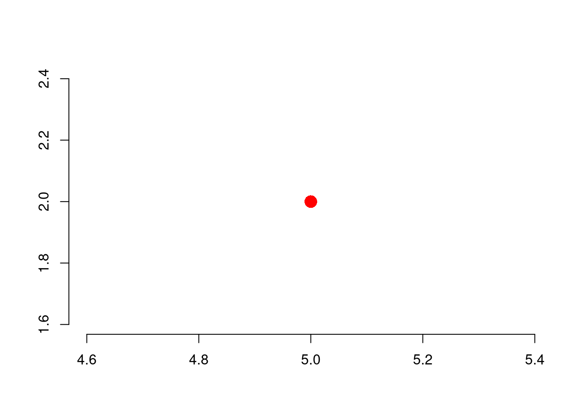
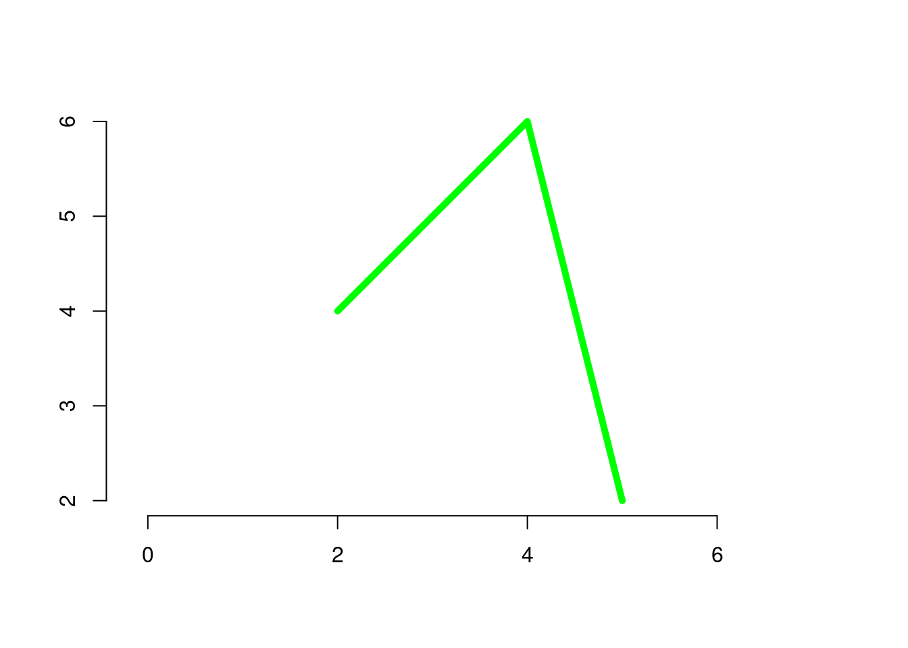
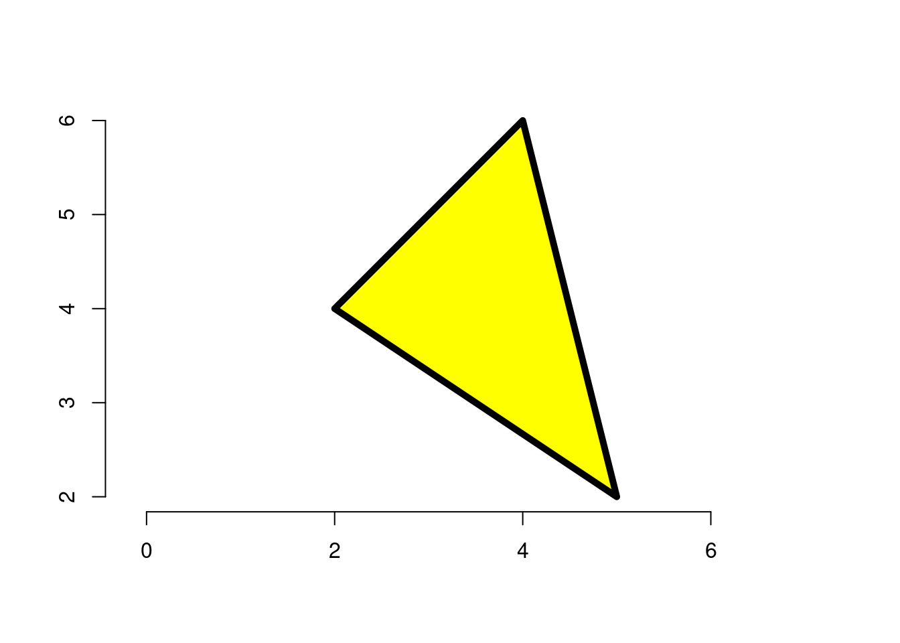
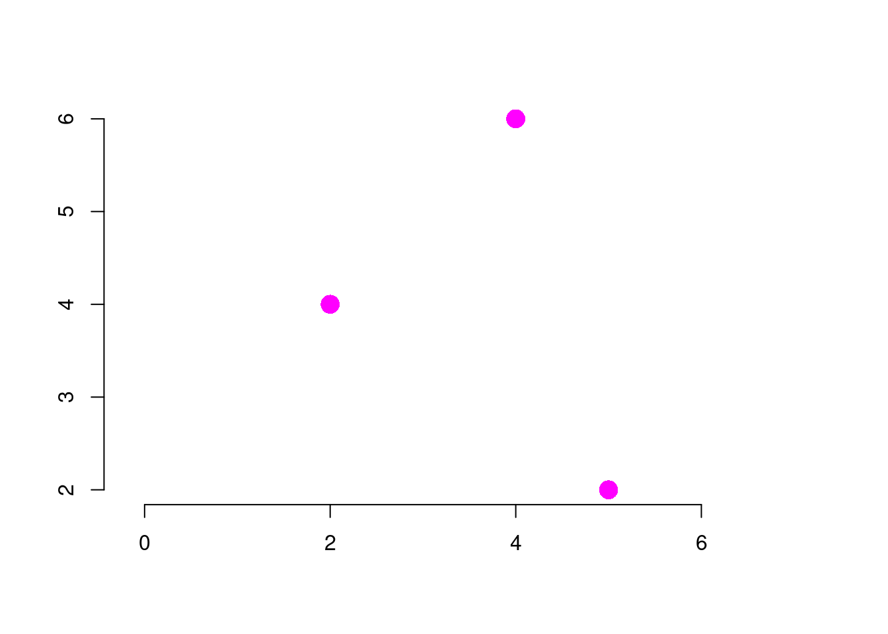
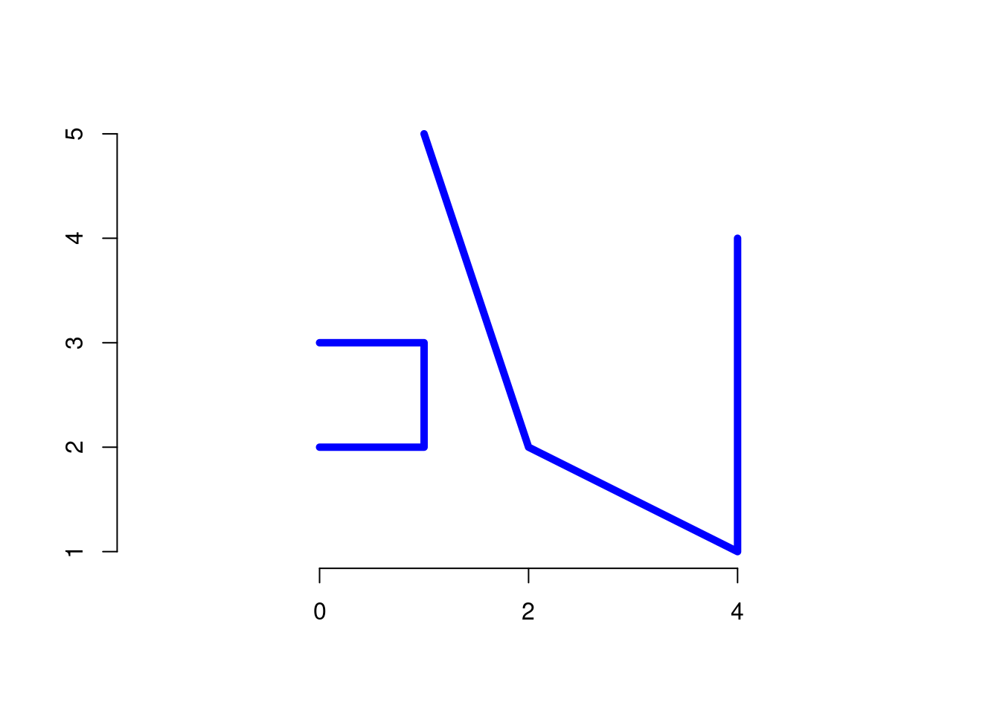
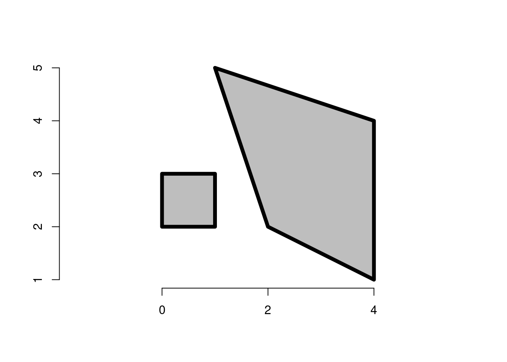
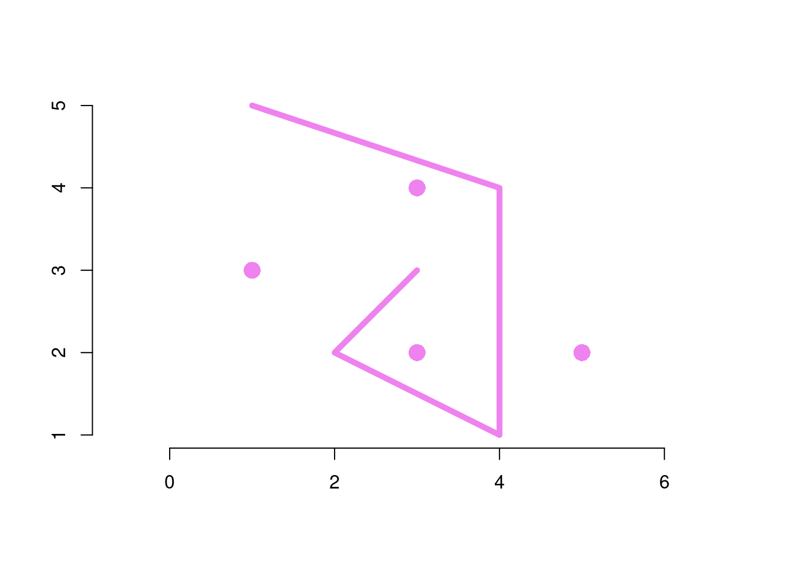
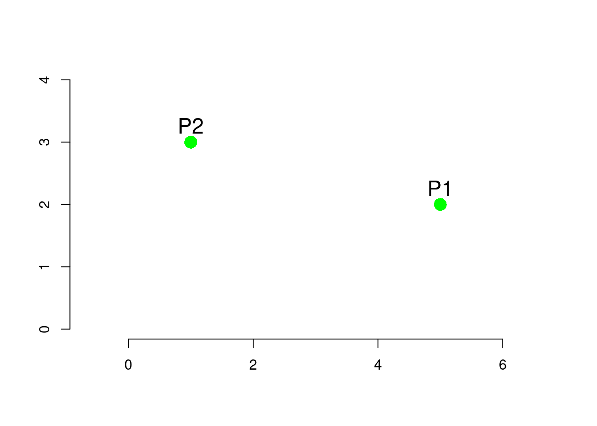
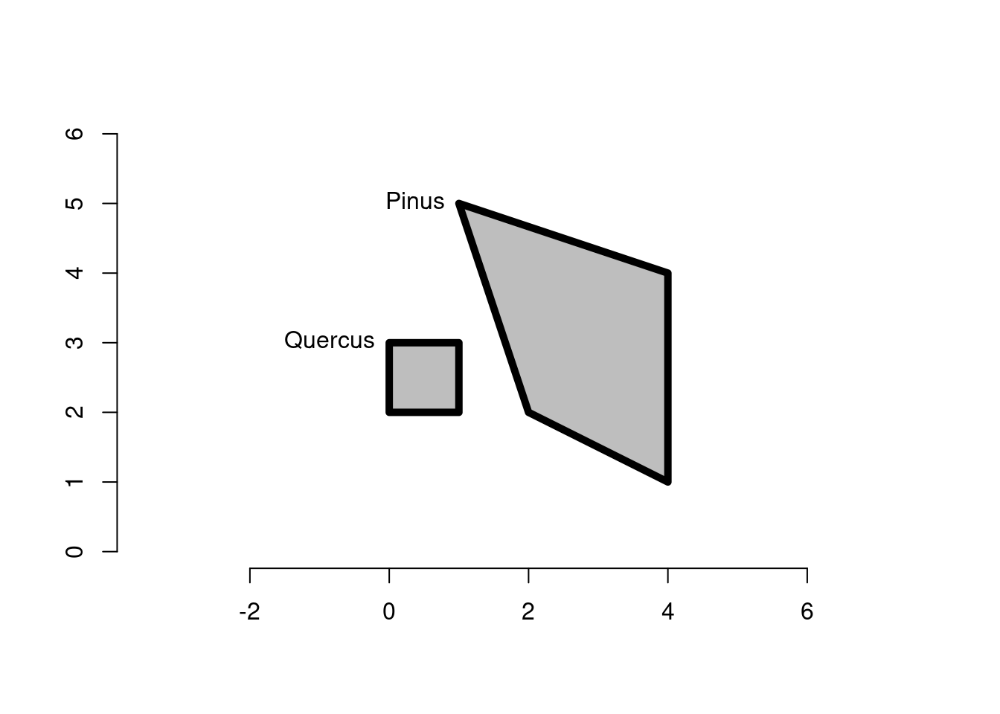
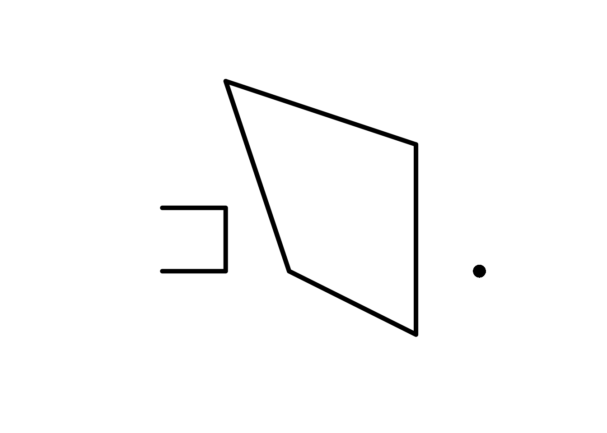

# Vector Data Model

## LINKS
sf package : https://cran.r-project.org/web/packages/sf/sf.pdf <br>
sp package : ...

## Packages used

### Install libraries
The following commands can be skipped in the RStudio instance provided by the teacher during the course.

```r
install.packages("sf")
install.packages("raster")
install.packages("spData")
devtools::install_github("Nowosad/spDataLarge")
install.packages("osmdata")
#install.packages("jqr",dependencies = TRUE)
#install.packages("remotes")
#remotes::install_github("ropensci/geojsonio")
#install.packages("geojsonio", dependencies = TRUE)
```
**Note:** the installation of geojsonio can be sometimes tricky.

### Load libraries

```r
library(sf)          # classes and functions for vector data
#> Linking to GEOS 3.10.2, GDAL 3.4.1, PROJ 8.2.1; sf_use_s2()
#> is TRUE
library(raster)      # classes and functions for raster data
#> Loading required package: sp
library(spData)      # load geographic data
library(spDataLarge) # load larger geographic data
require(osmdata)     # Open Street Map
#> Loading required package: osmdata
#> Data (c) OpenStreetMap contributors, ODbL 1.0. https://www.openstreetmap.org/copyright
#library(geojsonio)
#library(repr)
```


## An introduction to simple features
<br>


<font size=3>
Simple features is an open standard developed and endorsed by the <a href="https://www.opengeospatial.org">Open Geospatial Consortium (OGC)</a>, a not-for-profit organization.<br>
Simple Features (<b>SF</b>) is a hierarchical data model that represents a wide range of geometry types.<br>
Of 17 geometry types supported by the specification, only 7 are used in the vast majority of geographic research (see Figure below); these core geometry types are fully supported by the R package <i>sf</i>.<br>


Geometries are the basic building blocks of simple features.
Simple features in R can take on one of the 17 geometry types supported by the sf package.
We will focus on the seven most commonly used types: **POINT**, **LINESTRING**, **POLYGON**, **MULTIPOINT**, **MULTILINESTRING**, **MULTIPOLYGON**, **GEOMETRYCOLLECTION**.

Find the whole list of possible feature types in the <a href="http://postgis.net/docs/using_postgis_dbmanagement.html">PostGIS manual</a>.

<b style="color:red">The basis for each geometry type is the point.</b>

A point is simply a coordinate in **2D**, 3D or 4D space, from which the 7 geometry types can be derived:
<ul>
    <li>POINT (5 2)</li>
    <li>LINESTRING (1 5, 4 4, 4 1, 2 2, 3 2)</li>
    <li>POLYGON ((1 5, 2 2, 4 1, 4 4, 1 5))</li>
    <li>MULTIPOINT (5 2, 1 3, 3 4, 3 2)</li>
    <li>MULTILINESTRING ((1 5, 4 4, 4 1, 2 2, 3 2), (1 2, 2 4))</li>
    <li>MULTIPOLYGON (((1 5, 2 2, 4 1, 4 4, 1 5), (0 2, 1 2, 1 3, 0 3, 0 2)))</li>
    <li>GEOMETRYCOLLECTION (MULTIPOINT (5 2, 1 3, 3 4, 3 2), LINESTRING (1 5, 4 4, 4 1, 2 2, 3 2))</li>
</ul>

### Why simple features?
Because it is a widely supported data model that underlies data structures in many GIS applications including **QGIS** and **PostGIS**.<br>
A major advantage of this is that using the data model ensures your work is cross-transferable to other set-ups, for example importing from and exporting to spatial databases.


```r
vignette(package = "sf") # see which vignettes are available
vignette("sf1")          # an introduction to the package
```

## Simple feature geometry (sfg)
<br>

|Type|R sf function|
|---------|-----------|
|A point:| <font size=4 color="green">st_point( )</font>|
|A linestring:| <font size=4 color="green">st_linestring( )</font>|
|A polygon:| <font size=4 color="green">st_polygon( )</font>|
|A multipoint:| <font size=4 color="green">st_multipoint( )</font>|
|A multilinestring:| <font size=4 color="green">st_multilinestring( )</font>|
|A multipolygon:| <font size=4 color="green">st_multipolygon( )</font>|
|A geometry collection:| <font size=4 color="green">st_geometrycollection( )</font>|

<hr>

<b>sfg</b> objects can be created from three base R data types:
<ol>
<li>A numeric vector: a single point</li>
<li>A matrix: a set of points, where each row represents a point, a multipoint or linestring</li>
<li>A list: a collection of objects such as matrices, multilinestrings or geometry collections</li>
</ol>

**(I have to make some examples about vector, matrix and list of points)**

### POINT

Create a **POINT** geometry and plot it:

```r
pt = st_point( c(5,2) )
class(pt)
#> [1] "XY"    "POINT" "sfg"
pt
#> POINT (5 2)
plot(pt,col="red",pch=16, cex=2)
axis(1,labels=T)
axis(2,labels=T)
```



### LINESTRING
Create a matrix of 3 points connected by straight lines:

```r
linestring_matrix = rbind( c(5,2) , c(4,6), c(2,4) )
class( linestring_matrix )
#> [1] "matrix" "array"
```
Create a **LINESTRING** and plot it:

```r
ln = st_linestring( linestring_matrix )
class(ln)
#> [1] "XY"         "LINESTRING" "sfg"
plot(ln,col="green", lwd=5)
axis(1,labels=T)
axis(2,labels=T)
```



### POLYGON
Create a list of 4 points, in which the **first** and the **last** points are the same:

```r
polygon_list = list(rbind( c(2,4), c(4,6), c(5,2) , c(2,4) ))
class( polygon_list )
#> [1] "list"
```
Create a **POLYGON** of three points (since the first and the laste are identical...):

```r
pg = st_polygon( polygon_list )
class(pg)
#> [1] "XY"      "POLYGON" "sfg"
plot(pg,col="yellow",lwd=5)
axis(1,labels=T)
axis(2,labels=T)
```



### MULTIPOINT
Create a matrix of 3 points:

```r
multipoint_matrix = rbind( c(5,2) , c(4,6), c(2,4) )
class( multipoint_matrix )
#> [1] "matrix" "array"
```
Create a **MULTIPOINT** geometry and plot it (the set of points belongs to the same record / observation):

```r
mp = st_multipoint( multipoint_matrix )
class(mp)
#> [1] "XY"         "MULTIPOINT" "sfg"
plot(mp,col="magenta", pch=16, cex=2)
axis(1,labels=T)
axis(2,labels=T)
```



### MULTILINESTRING
Create a list of 10 points:

```r
multilinestring_list = list( rbind( c(1, 5), c(2, 2), c(4, 1), c(4, 4) ) , 
                             rbind( c(0, 2), c(1, 2), c(1, 3), c(0, 3) ) 
                           )
class(multilinestring_list)
#> [1] "list"
```

Create a **MULTILINESTRING** geometry and plot it:

```r
mln = st_multilinestring( multilinestring_list )
class(mln)
#> [1] "XY"              "MULTILINESTRING" "sfg"
plot(mln,col="blue",lwd=5)
axis(1,labels=T)
axis(2,labels=T)
```



### MULTIPOLYGON
Create a nested list (i.e. list of list) of 10 points (the same points used in the MULTILINESTRING before):

```r
multipolygon_list = list(list( rbind(c(1, 5), c(2, 2), c(4, 1), c(4, 4), c(1, 5)) ),
                         list( rbind(c(0, 2), c(1, 2), c(1, 3), c(0, 3), c(0, 2)) )
                        )
class(multipolygon_list)
#> [1] "list"
```

Create a **MULTIPOLYGON** geometry and plot it:

```r
mpg = st_multipolygon( multipolygon_list )
class(mpg)
#> [1] "XY"           "MULTIPOLYGON" "sfg"
plot(mpg,col="gray",lwd=5)
axis(1,labels=T)
axis(2,labels=T)
```



### GEOMETRYCOLLECTION

Create two matrices of 4 and 5 points:

```r
multipoint_matrix = rbind(c(5, 2), c(1, 3), c(3, 4), c(3, 2))
linestring_matrix = rbind(c(1, 5), c(4, 4), c(4, 1), c(2, 2), c(3, 3))
class(multipoint_matrix)
#> [1] "matrix" "array"
class(linestring_matrix)
#> [1] "matrix" "array"
```

Create a **GEOMETRYCOLLECTION** geometry fusing a **MULTIPOINT** and a **LINESTRING** together:

```r
geometrycollection_list = list(st_multipoint(multipoint_matrix),
                              st_linestring(linestring_matrix))
gcoll = st_geometrycollection(geometrycollection_list)
class(gcoll)
#> [1] "XY"                 "GEOMETRYCOLLECTION"
#> [3] "sfg"
```

```r
plot(gcoll,col="violet",pch=16,cex=2,lwd=5)
axis(1,labels=T)
axis(2,labels=T)
```




```r
st_geometry_type(gcoll)
#> [1] GEOMETRYCOLLECTION
#> 18 Levels: GEOMETRY POINT LINESTRING POLYGON ... TRIANGLE
```


## Simple features column (sfc)
Think about the requirement of a soil survey in which we need to observe two soil profiles in the field.
We have to collect soil samples from the topsoil and then carry out laboratory analysis to retrieve physical and chemical soil properties.
The first step is to select the localization of the two points, which means that we can attach to each geospatial point two coordinates given by our GPS device. For instance, using simple coordinates for the sake of clarity:

|Soil Profile ID | Geospatial Coordinates (x,y) |
|----------------|------------------------------|
| $P_1$          | <font color="green">(5,2)</font>  |
| $P_2$          | <font color="green">(1,3)</font>  |


We can create two **POINT** geometries as follows:

```r
P1 = st_point(c(5, 2))
P2 = st_point(c(1, 3))
```



How can we create an object in which collecting the geospatial location of the soil profiles?

### From pure geometry of distinct POINTs to a set of organized records (SFG)
One <b>sfg</b> object contains only a single simple feature geometry. <br>

A <b>simple feature geometry column</b> (<b>sfc</b>) can collect more **sfg** objects:

```r
points_sfc = st_sfc(P1, P1)
class(points_sfc)
#> [1] "sfc_POINT" "sfc"
```

Print in R console the metadata associated to the **SFC** object:

```r
print(points_sfc)
#> Geometry set for 2 features 
#> Geometry type: POINT
#> Dimension:     XY
#> Bounding box:  xmin: 5 ymin: 2 xmax: 5 ymax: 2
#> CRS:           NA
#> POINT (5 2)
#> POINT (5 2)
```

In addition, as you can see in the print above, the **sfc** can manage also the information about the Coordinate Reference System (**CRS**) in use.
In the command above `st_sfc(P1, P1)` we didn't set the CRS and the `st_sfc()` function has a dedicated argument to do this, e.g. `st_sfc(..., crs=4326)`.

A **Simple Feature Column** (**SFC**) can be built for any collection of geometry types.

In the following example, two records representing two forest patches are listed together to get a SFG:

```r
# Forest Patch #1, e.g. Pinus
polygon_list1 = list(rbind(c(1, 5), c(2, 2), c(4, 1), c(4, 4), c(1, 5)))
polygon1 = st_polygon(polygon_list1)
# Forest Patch #2, e.g. Quercus
polygon_list2 = list(rbind(c(0, 2), c(1, 2), c(1, 3), c(0, 3), c(0, 2)))
polygon2 = st_polygon(polygon_list2)
# SFG
polygon_sfc = st_sfc(polygon1, polygon2)
print(polygon_sfc)
#> Geometry set for 2 features 
#> Geometry type: POLYGON
#> Dimension:     XY
#> Bounding box:  xmin: 0 ymin: 1 xmax: 4 ymax: 5
#> CRS:           NA
#> POLYGON ((1 5, 2 2, 4 1, 4 4, 1 5))
#> POLYGON ((0 2, 1 2, 1 3, 0 3, 0 2))
```

```r
plot(polygon_sfc, col="gray", lwd=5, xlim=c(-1,5), ylim=c(0,6))
```

<div class="figure">

<p class="caption">(\#fig:sfc-polygons-forest-types)Two forest patches managed using a SFC.</p>
</div>

It is also possible to create a **SFC** object from a set of **SFG** having different geometry types:


```r
# combining objects created above:
mixed_sfc = st_sfc(P1, mln, polygon1)
# plot:
plot(mixed_sfc, pch=16, cex=2, lwd=5)
```



### CRS (Coordinate Reference System)
<b>SFC</b> objects can additionally store information on the coordinate reference systems (CRS).<br>
To specify a certain CRS, we can use the <b>EPSG</b> (SRID) or <b>proj4string</b> attributes of an sfc object. <br>


```r
print(points_sfc)
#> Geometry set for 2 features 
#> Geometry type: POINT
#> Dimension:     XY
#> Bounding box:  xmin: 5 ymin: 2 xmax: 5 ymax: 2
#> CRS:           NA
#> POINT (5 2)
#> POINT (5 2)
```

The default value of EPSG (SRID) and proj4string is <b>NA</b> (Not Available), as can be verified with the function `st_crs( )`:

```r
st_crs(points_sfc)
#> Coordinate Reference System: NA
```

The argument `crs` is used to set the Reference System in use by the coordinates. In our simple example, we assume GCS (**G**eodetic **C**oordinate reference **S**ystem) in which the points $P_1$ and $P_2$ have geographical coordinates **Longitude** and **Latitude** (WGS84 datum):

```r
# EPSG definition
points_sfc_wgs = st_sfc(P1, P2, crs = 4326)
print(points_sfc_wgs)
#> Geometry set for 2 features 
#> Geometry type: POINT
#> Dimension:     XY
#> Bounding box:  xmin: 1 ymin: 2 xmax: 5 ymax: 3
#> Geodetic CRS:  WGS 84
#> POINT (5 2)
#> POINT (1 3)
```

A detailed reading of the CRS is made:

```r
st_crs(points_sfc_wgs)
#> Coordinate Reference System:
#>   User input: EPSG:4326 
#>   wkt:
#> GEOGCRS["WGS 84",
#>     ENSEMBLE["World Geodetic System 1984 ensemble",
#>         MEMBER["World Geodetic System 1984 (Transit)"],
#>         MEMBER["World Geodetic System 1984 (G730)"],
#>         MEMBER["World Geodetic System 1984 (G873)"],
#>         MEMBER["World Geodetic System 1984 (G1150)"],
#>         MEMBER["World Geodetic System 1984 (G1674)"],
#>         MEMBER["World Geodetic System 1984 (G1762)"],
#>         MEMBER["World Geodetic System 1984 (G2139)"],
#>         ELLIPSOID["WGS 84",6378137,298.257223563,
#>             LENGTHUNIT["metre",1]],
#>         ENSEMBLEACCURACY[2.0]],
#>     PRIMEM["Greenwich",0,
#>         ANGLEUNIT["degree",0.0174532925199433]],
#>     CS[ellipsoidal,2],
#>         AXIS["geodetic latitude (Lat)",north,
#>             ORDER[1],
#>             ANGLEUNIT["degree",0.0174532925199433]],
#>         AXIS["geodetic longitude (Lon)",east,
#>             ORDER[2],
#>             ANGLEUNIT["degree",0.0174532925199433]],
#>     USAGE[
#>         SCOPE["Horizontal component of 3D system."],
#>         AREA["World."],
#>         BBOX[-90,-180,90,180]],
#>     ID["EPSG",4326]]
```


## The SF class
A <b>'SF Geometry'</b> object is purely <u>geometric</u> and a <b>'SF Column'</b> object is a <u>geographic</u> building block.<br>
In order to create a SF we need to fulfil the following steps:

 1. Create two SFG, e.g. POINT geometry ($P_1$ and $P_2$) (add a link here to the section).
 2. Create a SFC, e.g. collect together $P_1$ and $P_2$ and define a **CRS** (add a link here to the section).
 3. Create a table of attributes (or variables) by means of which real-world entities can be described and create a **Simple Feature** (**SF**) `st_sf( )`.

Real-world entities, such as soils, have measurable characteristics that we can be stored in attributes or variables.<br>
The third and final building block to get a **SF** is the creation of these non-geographic attributes.<br>
Let's build an example from scratch:

Step 01:

```r
P1_sfg = st_point(c(5, 2))
P2_sfg = st_point(c(1, 3))
print(P1_sfg)
#> POINT (5 2)
```

Step 02:

```r
P_sfc <- st_sfc(P1_sfg, P2_sfg, crs=4326)
print(P_sfc)
#> Geometry set for 2 features 
#> Geometry type: POINT
#> Dimension:     XY
#> Bounding box:  xmin: 1 ymin: 2 xmax: 5 ymax: 3
#> Geodetic CRS:  WGS 84
#> POINT (5 2)
#> POINT (1 3)
```

Step 03:

```r
attrib <- data.frame( clay = c(25,47), sand = c(30,23), silt = c(45,30) )
P_sf <- st_sf(attrib,P_sfc)
print(P_sf)
#> Simple feature collection with 2 features and 3 fields
#> Geometry type: POINT
#> Dimension:     XY
#> Bounding box:  xmin: 1 ymin: 2 xmax: 5 ymax: 3
#> Geodetic CRS:  WGS 84
#>   clay sand silt       P_sfc
#> 1   25   30   45 POINT (5 2)
#> 2   47   23   30 POINT (1 3)
```

In the above R object we have all the information, both data and metadata, required to fully describe a Simple Feature as defined by the OGC Standard.<br>

The vector data model created for the simple example above can be managed in R but also exported to be managed in whatever software capable of GIS funcionalities.

### Creation of Simple Feature

#### From scratch
(reference the example above using P1 and P2, otherwise create a new example -> forest or livestock)


#### Import existent Vector Geodata: measurements from Climatic Ground Stations
(I could add one more examples using my smart Agrometeorological Weather Station).
To illustrate attributes, we will use the temperature and precipitation measured at ground weather stations.


