# Vector Data Model

## LINKS
sf package : https://cran.r-project.org/web/packages/sf/sf.pdf <br>
sp package : ...

## Packages used

### Install libraries
The following commands can be skipped in the RStudio instance provided by the teacher during the course.


```r
install.packages("sf")
install.packages("raster")
install.packages("spData")
devtools::install_github("Nowosad/spDataLarge")
install.packages("osmdata")
```

**Note:** the installation of geojsonio can be sometimes tricky.

### Load libraries

```r
library(sf)          # classes and functions for vector data
#> Linking to GEOS 3.10.2, GDAL 3.4.1, PROJ 8.2.1; sf_use_s2()
#> is TRUE
library(raster)      # classes and functions for raster data
#> Loading required package: sp
library(spData)      # load geographic data
library(spDataLarge) # load larger geographic data
library(osmdata)     # Open Street Map
#> Data (c) OpenStreetMap contributors, ODbL 1.0. https://www.openstreetmap.org/copyright
library(kableExtra)  # see :: https://cran.r-project.org/web/packages/kableExtra/vignettes/awesome_table_in_html.html
```


## An introduction to simple features
<div class="figure" style="text-align: left">

<p class="caption">(\#fig:SF-geometries)Simple Feature Geometries.</p>
</div>

Simple features is an open standard developed and endorsed by the <a href="https://www.opengeospatial.org">Open Geospatial Consortium (OGC)</a>, a not-for-profit organization (see Figure \@ref(fig:SF-geometries) for few examples).<br>
Simple Features (<b>SF</b>) is a hierarchical data model that represents a wide range of geometry types.<br>
Of 17 geometry types supported by the specification, only 7 are used in the vast majority of geographic research (see Figure below); these core geometry types are fully supported by the R package <i>sf</i>.<br>


Geometries are the basic building blocks of simple features.
Simple features in R can take on one of the 17 geometry types supported by the sf package.
We will focus on the seven most commonly used types: **POINT**, **LINESTRING**, **POLYGON**, **MULTIPOINT**, **MULTILINESTRING**, **MULTIPOLYGON**, **GEOMETRYCOLLECTION**.

Find the whole list of possible feature types in the <a href="http://postgis.net/docs/using_postgis_dbmanagement.html">PostGIS manual</a>.

<b style="color:red">The basis for each geometry type is the point.</b>

A point is simply a coordinate in **2D**, 3D or 4D space, from which the 7 geometry types can be derived:
<ul>
    <li>POINT (5 2)</li>
    <li>LINESTRING (1 5, 4 4, 4 1, 2 2, 3 2)</li>
    <li>POLYGON ((1 5, 2 2, 4 1, 4 4, 1 5))</li>
    <li>MULTIPOINT (5 2, 1 3, 3 4, 3 2)</li>
    <li>MULTILINESTRING ((1 5, 4 4, 4 1, 2 2, 3 2), (1 2, 2 4))</li>
    <li>MULTIPOLYGON (((1 5, 2 2, 4 1, 4 4, 1 5), (0 2, 1 2, 1 3, 0 3, 0 2)))</li>
    <li>GEOMETRYCOLLECTION (MULTIPOINT (5 2, 1 3, 3 4, 3 2), LINESTRING (1 5, 4 4, 4 1, 2 2, 3 2))</li>
</ul>

### Why simple features?
Because it is a widely supported data model that underlies data structures in many GIS applications including **QGIS** and **PostGIS**.<br>
A major advantage of this is that using the data model ensures your work is cross-transferable to other set-ups, for example importing from and exporting to spatial databases.


```r
vignette(package = "sf") # see which vignettes are available
vignette("sf1")          # an introduction to the package
```

## Simple feature geometry (sfg)
<br>

|Type|R sf function|
|---------|-----------|
|A point:| <font size=4 color="green">st_point( )</font>|
|A linestring:| <font size=4 color="green">st_linestring( )</font>|
|A polygon:| <font size=4 color="green">st_polygon( )</font>|
|A multipoint:| <font size=4 color="green">st_multipoint( )</font>|
|A multilinestring:| <font size=4 color="green">st_multilinestring( )</font>|
|A multipolygon:| <font size=4 color="green">st_multipolygon( )</font>|
|A geometry collection:| <font size=4 color="green">st_geometrycollection( )</font>|

<br>
<b>sfg</b> objects can be created from three base R data types:
<ol>
<li>A numeric vector: a single point</li>
<li>A matrix: a set of points, where each row represents a point, a multipoint or linestring</li>
<li>A list: a collection of objects such as matrices, multilinestrings or geometry collections</li>
</ol>

**(I have to make some examples about vector, matrix and list of points)**

### POINT

Create a **POINT** geometry and visualize it (Figure \@ref(fig:fig-sfg-point)).

```r
pt = st_point( c(5,2) )
class(pt)
#> [1] "XY"    "POINT" "sfg"
pt
#> POINT (5 2)
```


```r
plot(pt,col="red",pch=16, cex=2)
axis(1,labels=T)
axis(2,labels=T)
```

<div class="figure" style="text-align: left">
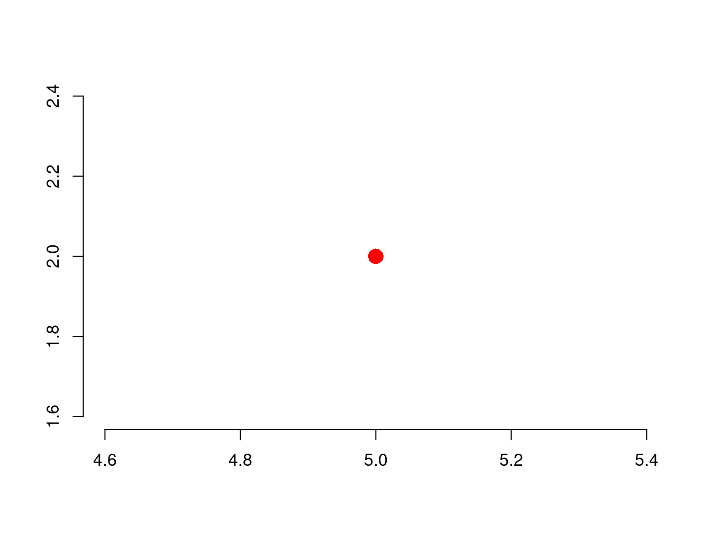
<p class="caption">(\#fig:fig-sfg-point)Example of POINT geometry.</p>
</div>

### LINESTRING
Create a matrix of 3 points connected by straight lines:

```r
linestring_matrix = rbind( c(2,4), c(4,6), c(5,2) )
class( linestring_matrix )
#> [1] "matrix" "array"
```

Create a **LINESTRING** and visualize it (Figure \@ref(fig:fig-sfg-linestring)).

```r
ln = st_linestring( linestring_matrix )
class(ln)
#> [1] "XY"         "LINESTRING" "sfg"
```


```r
plot(ln,col="green", lwd=5)
axis(1,labels=T)
axis(2,labels=T)
```

<div class="figure" style="text-align: left">
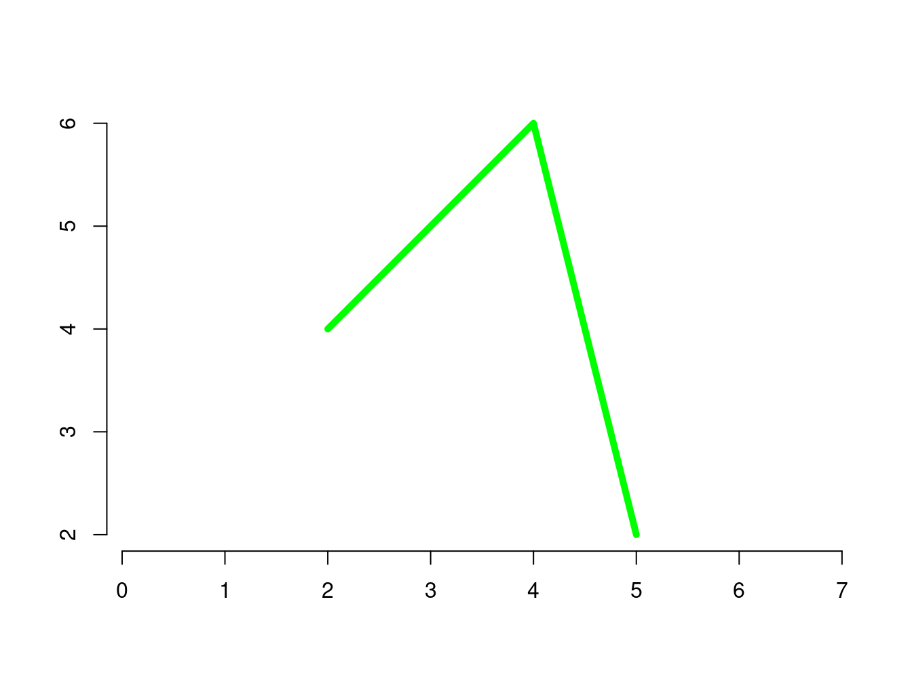
<p class="caption">(\#fig:fig-sfg-linestring)Example of LINESTRING geometry.</p>
</div>

### POLYGON
Create a list of 4 points, in which the **first** and the **last** points are the same:

```r
polygon_list = list(rbind( c(2,4), c(4,6), c(5,2) , c(2,4) ))
class( polygon_list )
#> [1] "list"
```

Create a **POLYGON** and visualize it (Figure \@ref(fig:fig-sfg-polygon)).


```r
pg = st_polygon( polygon_list )
class(pg)
#> [1] "XY"      "POLYGON" "sfg"
```

The polygon is made by same three points used in Figure \@ref(fig:fig-sfg-linestring), but 4 points are considered in the function above: why?<br>
Because the first and the last points are identical.

```r
plot(pg,col="yellow",lwd=5)
axis(1,labels=T)
axis(2,labels=T)
```

<div class="figure" style="text-align: left">
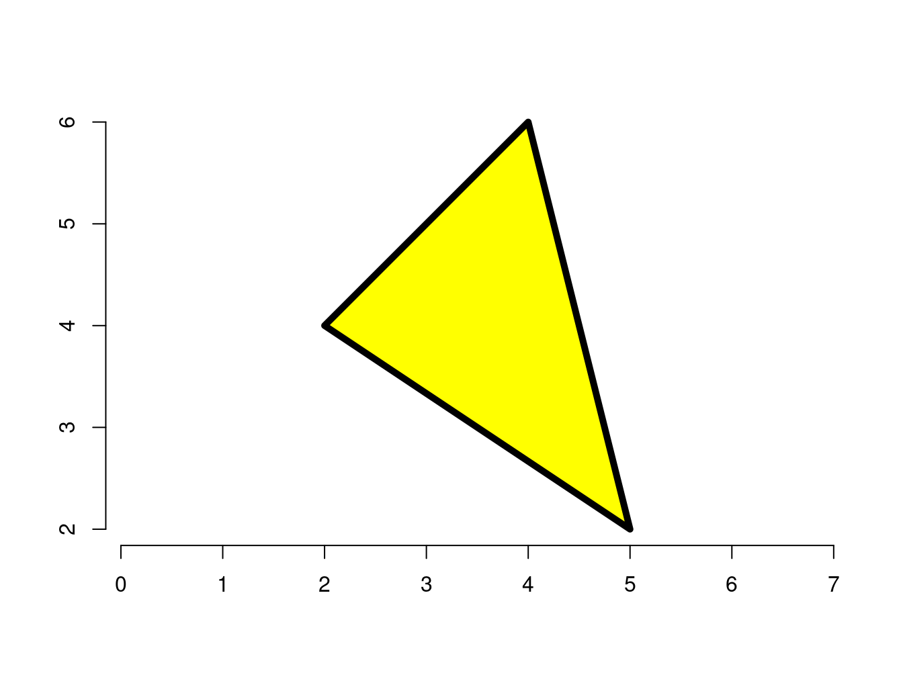
<p class="caption">(\#fig:fig-sfg-polygon)Example of POLYGON geometry.</p>
</div>

### MULTIPOINT
Create a matrix of 3 points:

```r
multipoint_matrix = rbind( c(2,4) , c(4,6), c(5,2) )
class( multipoint_matrix )
#> [1] "matrix" "array"
```

Create a **MULTIPOINT** geometry and visualize it (Figure \@ref(fig:fig-sfg-multipoint)).

```r
mp = st_multipoint( multipoint_matrix )
class(mp)
#> [1] "XY"         "MULTIPOINT" "sfg"
```


```r
plot(mp,col="magenta", pch=16, cex=2)
axis(1,labels=T)
axis(2,labels=T)
```

<div class="figure" style="text-align: left">
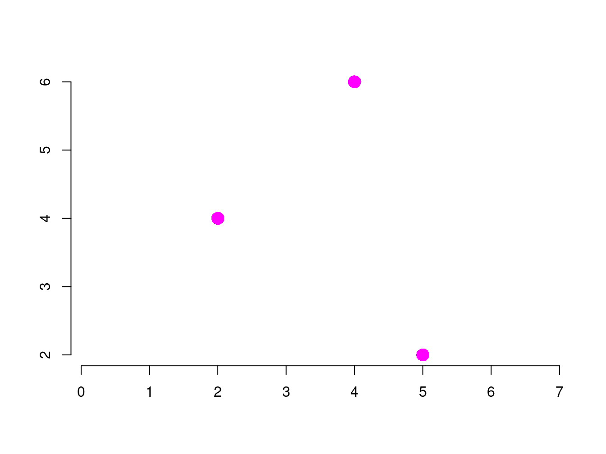
<p class="caption">(\#fig:fig-sfg-multipoint)Example of MULTIPOINT geometry.</p>
</div>
The same set of points used for the LINESTRING (Figure \@ref(fig:fig-sfg-linestring)) and POLYGON (Figure \@ref(fig:fig-sfg-polygon)) is used.

### MULTILINESTRING
Create a list of 10 points:

```r
multilinestring_list = list( rbind( c(1, 5), c(2, 2), c(4, 1), c(4, 4) ) , 
                             rbind( c(0, 2), c(1, 2), c(1, 3), c(0, 3) ) 
                           )
class(multilinestring_list)
#> [1] "list"
```

Create a **MULTILINESTRING** geometry and visualize it (Figure \@ref(fig:fig-sfg-multilinestring)).

```r
mln = st_multilinestring( multilinestring_list )
class(mln)
#> [1] "XY"              "MULTILINESTRING" "sfg"
```


```r
plot(mln,col="blue",lwd=5)
axis(1,labels=T)
axis(2,labels=T)
```

<div class="figure" style="text-align: left">
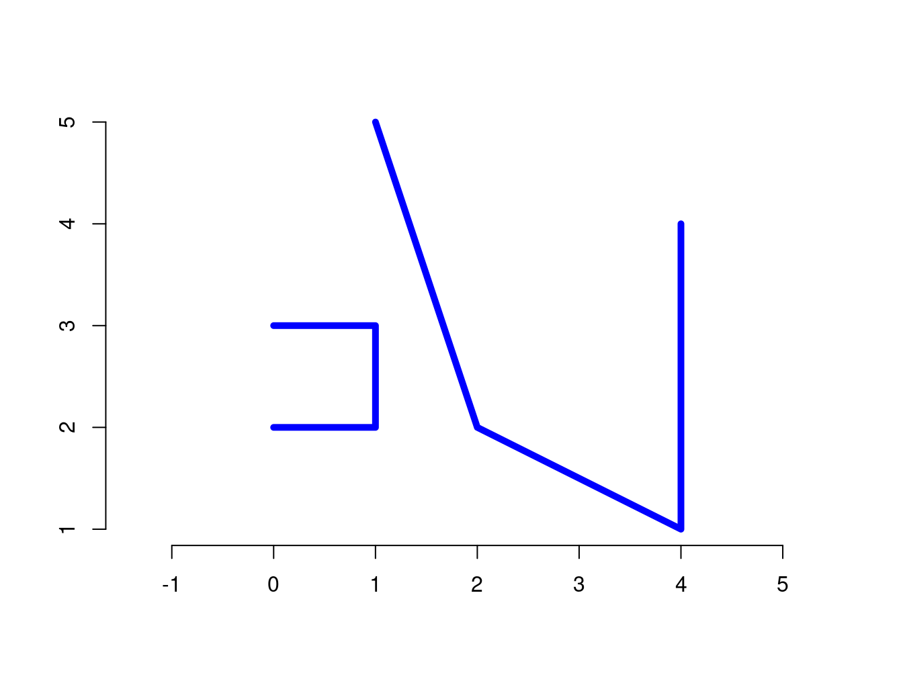
<p class="caption">(\#fig:fig-sfg-multilinestring)Example of MULTILINESTRING geometry.</p>
</div>

### MULTIPOLYGON
Create a nested list (i.e. list of list) of 10 points (the same points used in the MULTILINESTRING before, see Figure \@ref(fig:fig-sfg-multilinestring)):

```r
multipolygon_list = list(list( rbind(c(1, 5), c(2, 2), c(4, 1), c(4, 4), c(1, 5)) ),
                         list( rbind(c(0, 2), c(1, 2), c(1, 3), c(0, 3), c(0, 2)) )
                        )
class(multipolygon_list)
#> [1] "list"
```

Create a **MULTIPOLYGON** geometry and visualize it (Figure \@ref(fig:fig-sfg-multipolygon)).

```r
mpg = st_multipolygon( multipolygon_list )
class(mpg)
#> [1] "XY"           "MULTIPOLYGON" "sfg"
```


```r
plot(mpg,col="gray",lwd=5)
axis(1,labels=T)
axis(2,labels=T)
```

<div class="figure" style="text-align: left">
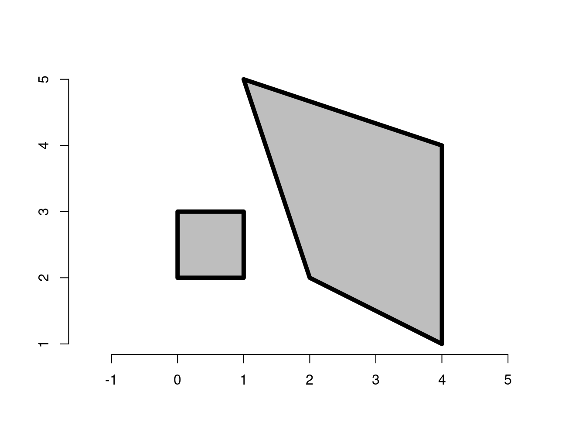
<p class="caption">(\#fig:fig-sfg-multipolygon)Example of MULTIPOLYGON geometry.</p>
</div>

### GEOMETRYCOLLECTION

Create two matrices of 4 and 5 points:

```r
multipoint_matrix = rbind(c(5, 2), c(1, 3), c(3, 4), c(3, 2))
linestring_matrix = rbind(c(1, 5), c(4, 4), c(4, 1), c(2, 2), c(3, 3))
class(multipoint_matrix)
#> [1] "matrix" "array"
class(linestring_matrix)
#> [1] "matrix" "array"
```

Create a **GEOMETRYCOLLECTION** geometry fusing a **MULTIPOINT** and a **LINESTRING** together:

```r
geometrycollection_list = list(st_multipoint(multipoint_matrix),
                              st_linestring(linestring_matrix))
gcoll = st_geometrycollection(geometrycollection_list)
class(gcoll)
#> [1] "XY"                 "GEOMETRYCOLLECTION"
#> [3] "sfg"
```

Visualze it:

```r
plot(gcoll,col="violet",pch=16,cex=2,lwd=5)
axis(1,labels=T)
axis(2,labels=T)
```

<div class="figure" style="text-align: left">
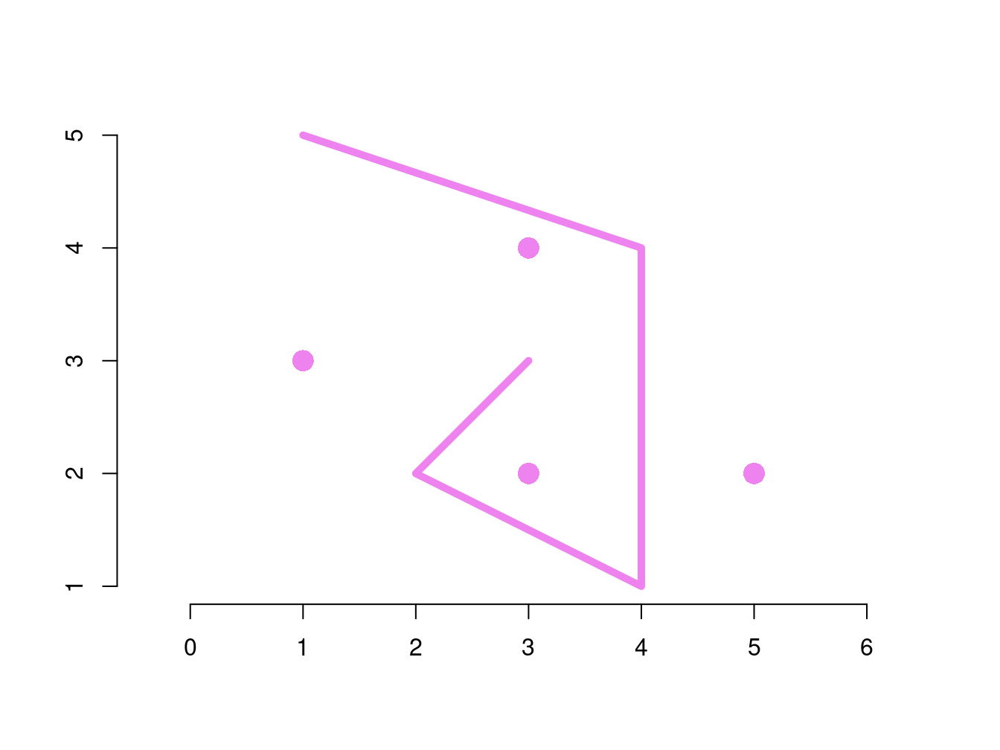
<p class="caption">(\#fig:fig-sfg-geometrycollection)Example of GEOMETRYCOLLECTION geometry.</p>
</div>

What is the geometry type?

```r
st_geometry_type(gcoll)
#> [1] GEOMETRYCOLLECTION
#> 18 Levels: GEOMETRY POINT LINESTRING POLYGON ... TRIANGLE
```


## Simple features column (sfc)
Think about the requirement of a soil survey in which we need to observe two soil profiles in the field.
We have to collect soil samples from the topsoil and then carry out laboratory analysis to retrieve physical and chemical soil properties.
The first step is to select the localization of the two points, which means that we can attach to each geospatial point two coordinates given by our GPS device. For instance, using simple coordinates for the sake of clarity:

|Soil Profile ID | Geospatial Coordinates (x,y) |
|----------------|------------------------------|
| $P_1$          | <font color="green">(5,2)</font>  |
| $P_2$          | <font color="green">(1,3)</font>  |


We can create two **POINT** geometries as follows:

```r
P1 = st_point(c(5, 2))
P2 = st_point(c(1, 3))
```


How can we create an object in which collecting the geospatial location of the soil profiles?

### From pure geometry of distinct POINTs to a set of organized records (SFG)
One <b>sfg</b> object contains only a single simple feature geometry. <br>

A <b>simple feature geometry column</b> (<b>sfc</b>) can collect more **sfg** objects:

```r
points_sfc = st_sfc(P1, P2)
class(points_sfc)
#> [1] "sfc_POINT" "sfc"
```

Print in R console the metadata associated to the **SFC** object:

```r
print(points_sfc)
#> Geometry set for 2 features 
#> Geometry type: POINT
#> Dimension:     XY
#> Bounding box:  xmin: 1 ymin: 2 xmax: 5 ymax: 3
#> CRS:           NA
#> POINT (5 2)
#> POINT (1 3)
```

In addition, as you can see in the print above, the **sfc** can manage also the information about the Coordinate Reference System (**CRS**) in use.
In the command above `st_sfc(P1, P1)` we didn't set the CRS and the `st_sfc()` function has a dedicated argument to do this, e.g. `st_sfc(..., crs=4326)`.

A **Simple Feature Column** (**SFC**) can be built for any collection of geometry types.

In the following example, two records representing two forest patches are listed together to get a SFG:

```r
# Forest Patch #1, e.g. Pinus
polygon_list1 = list(rbind(c(1, 5), c(2, 2), c(4, 1), c(4, 4), c(1, 5)))
polygon1 = st_polygon(polygon_list1)
# Forest Patch #2, e.g. Quercus
polygon_list2 = list(rbind(c(0, 2), c(1, 2), c(1, 3), c(0, 3), c(0, 2)))
polygon2 = st_polygon(polygon_list2)
# SFG
polygon_sfc = st_sfc(polygon1, polygon2)
print(polygon_sfc)
#> Geometry set for 2 features 
#> Geometry type: POLYGON
#> Dimension:     XY
#> Bounding box:  xmin: 0 ymin: 1 xmax: 4 ymax: 5
#> CRS:           NA
#> POLYGON ((1 5, 2 2, 4 1, 4 4, 1 5))
#> POLYGON ((0 2, 1 2, 1 3, 0 3, 0 2))
```

```r
plot(polygon_sfc, col="gray", lwd=5, xlim=c(-1,5), ylim=c(0,6))
```

<div class="figure">
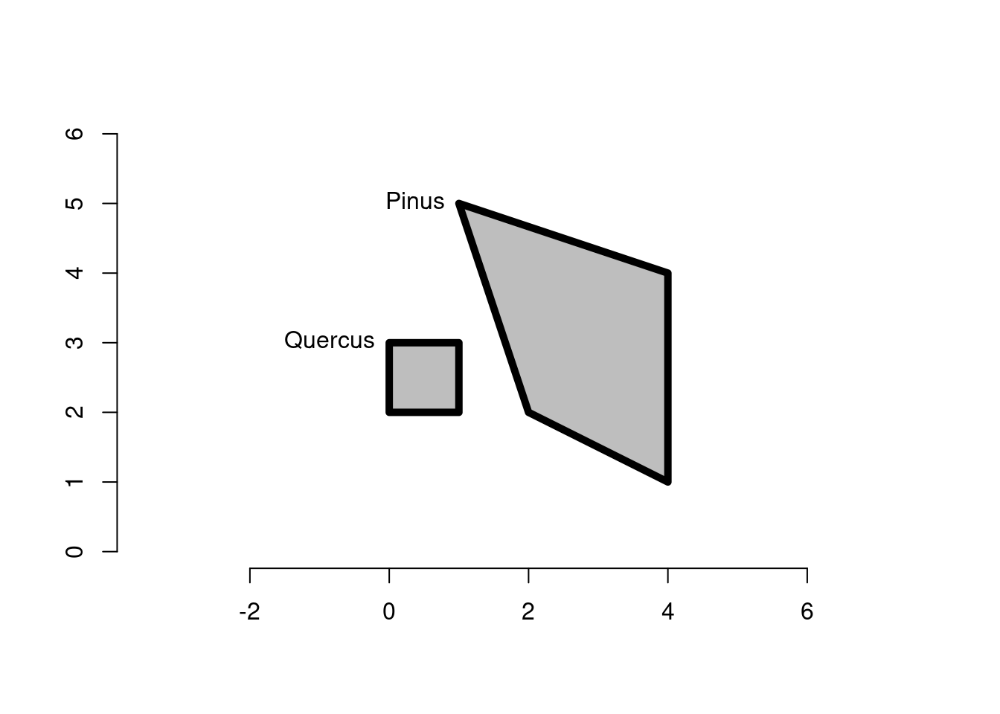
<p class="caption">(\#fig:sfc-polygons-forest-types)Two forest patches managed using a SFC.</p>
</div>

It is also possible to create a **SFC** object from a set of **SFG** having different geometry types:


```r
# combining objects created above:
mixed_sfc = st_sfc(P1, mln, polygon1)
# plot:
plot(mixed_sfc, pch=16, cex=2, lwd=5)
```

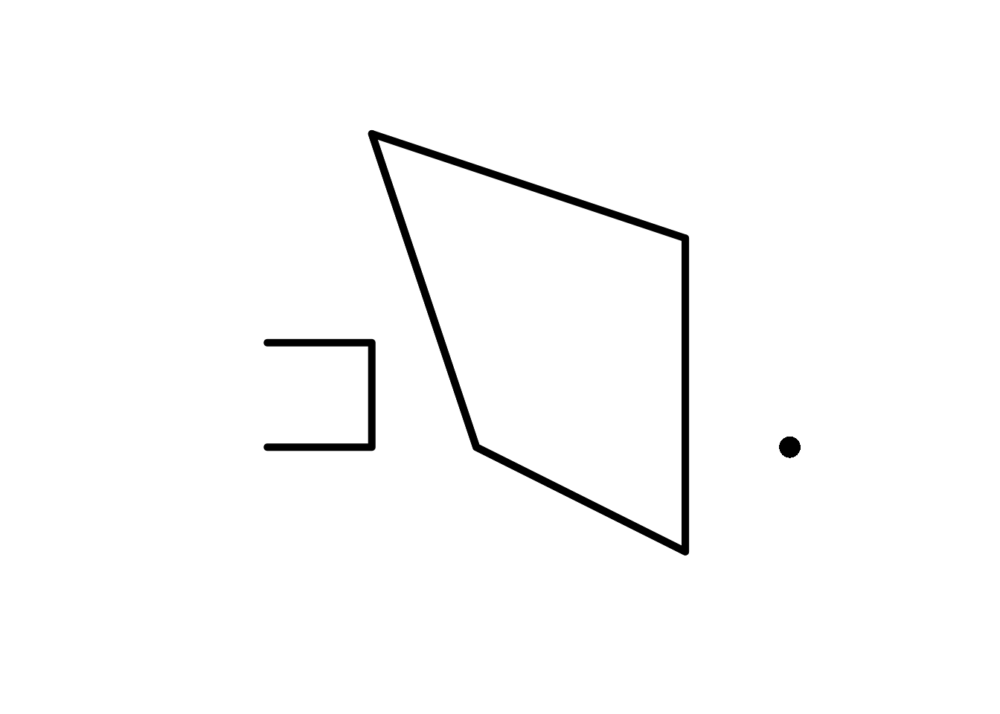

### CRS (Coordinate Reference System)
<b>SFC</b> objects can additionally store information on the coordinate reference systems (CRS).<br>
To specify a certain CRS, we can use the <b>EPSG</b> (SRID) or <b>proj4string</b> attributes of an sfc object. <br>


```r
print(points_sfc)
#> Geometry set for 2 features 
#> Geometry type: POINT
#> Dimension:     XY
#> Bounding box:  xmin: 1 ymin: 2 xmax: 5 ymax: 3
#> CRS:           NA
#> POINT (5 2)
#> POINT (1 3)
```

The default value of EPSG (SRID) and proj4string is <b>NA</b> (Not Available), as can be verified with the function `st_crs( )`:

```r
st_crs(points_sfc)
#> Coordinate Reference System: NA
```

The argument `crs` is used to set the Reference System in use by the coordinates. In our simple example, we assume GCS (**G**eodetic **C**oordinate reference **S**ystem) in which the points $P_1$ and $P_2$ have geographical coordinates **Longitude** and **Latitude** (WGS84 datum):

```r
# EPSG definition
points_sfc_wgs = st_sfc(P1, P2, crs = 4326)
print(points_sfc_wgs)
#> Geometry set for 2 features 
#> Geometry type: POINT
#> Dimension:     XY
#> Bounding box:  xmin: 1 ymin: 2 xmax: 5 ymax: 3
#> Geodetic CRS:  WGS 84
#> POINT (5 2)
#> POINT (1 3)
```

A detailed reading of the CRS is made:

```r
st_crs(points_sfc_wgs)
#> Coordinate Reference System:
#>   User input: EPSG:4326 
#>   wkt:
#> GEOGCRS["WGS 84",
#>     ENSEMBLE["World Geodetic System 1984 ensemble",
#>         MEMBER["World Geodetic System 1984 (Transit)"],
#>         MEMBER["World Geodetic System 1984 (G730)"],
#>         MEMBER["World Geodetic System 1984 (G873)"],
#>         MEMBER["World Geodetic System 1984 (G1150)"],
#>         MEMBER["World Geodetic System 1984 (G1674)"],
#>         MEMBER["World Geodetic System 1984 (G1762)"],
#>         MEMBER["World Geodetic System 1984 (G2139)"],
#>         ELLIPSOID["WGS 84",6378137,298.257223563,
#>             LENGTHUNIT["metre",1]],
#>         ENSEMBLEACCURACY[2.0]],
#>     PRIMEM["Greenwich",0,
#>         ANGLEUNIT["degree",0.0174532925199433]],
#>     CS[ellipsoidal,2],
#>         AXIS["geodetic latitude (Lat)",north,
#>             ORDER[1],
#>             ANGLEUNIT["degree",0.0174532925199433]],
#>         AXIS["geodetic longitude (Lon)",east,
#>             ORDER[2],
#>             ANGLEUNIT["degree",0.0174532925199433]],
#>     USAGE[
#>         SCOPE["Horizontal component of 3D system."],
#>         AREA["World."],
#>         BBOX[-90,-180,90,180]],
#>     ID["EPSG",4326]]
```


## The SF class
A <b>'SF Geometry'</b> object is purely <u>geometric</u> and a <b>'SF Column'</b> object is a <u>geographic</u> building block.<br>
In order to create a SF we need to fulfil the following steps:

 1. Create two SFG, e.g. POINT geometry ($P_1$ and $P_2$) (add a link here to the section).
 2. Create a SFC, e.g. collect together $P_1$ and $P_2$ and define a **CRS** (add a link here to the section).
 3. Create a table of attributes (or variables) by means of which real-world entities can be described and create a **Simple Feature** (**SF**) `st_sf( )`.

### Creation of a Simple Feature
A simple feature can be created:

 - from scratch
   - using synthetic data 
   - using real-world data
 - from a vector data model stored in a
   - local file
   - remote file

#### From scratch | synthetic data
Let's build an example from scratch.

**Step 01:** create purely geometric objects.

```r
P1_sfg = st_point(c(5, 2))
P2_sfg = st_point(c(1, 3))
print(P1_sfg)
#> POINT (5 2)
```

**Step 02:** create a geospatial object

```r
P_sfc <- st_sfc(P1_sfg, P2_sfg, crs=4326)
print(P_sfc)
#> Geometry set for 2 features 
#> Geometry type: POINT
#> Dimension:     XY
#> Bounding box:  xmin: 1 ymin: 2 xmax: 5 ymax: 3
#> Geodetic CRS:  WGS 84
#> POINT (5 2)
#> POINT (1 3)
```

**Step 03:** add attributes
Real-world entities, such as soils, have measurable characteristics that can be stored in attributes or variables.<br>
The third and final building block to get a **SF** is the creation of these non-geographic attributes.<br>

```r
attrib <- data.frame( clay = c(25,47), sand = c(30,23), silt = c(45,30) )
P_sf <- st_sf(attrib,P_sfc)
print(P_sf)
#> Simple feature collection with 2 features and 3 fields
#> Geometry type: POINT
#> Dimension:     XY
#> Bounding box:  xmin: 1 ymin: 2 xmax: 5 ymax: 3
#> Geodetic CRS:  WGS 84
#>   clay sand silt       P_sfc
#> 1   25   30   45 POINT (5 2)
#> 2   47   23   30 POINT (1 3)
```

In the above R object we have all the information, both data and metadata, required to fully describe a Simple Feature as defined by the OGC Standard.<br>

The vector data model created for the simple example above can be managed in R but also exported to be managed in whatever software capable of GIS funcionalities.

(NOTE: create a new example -> forest or livestock)

#### From scratch | real-world data {#scratch-realworld}
In this example we read data from files which are not designed to implement any vector data model.<br>
The temperature and precipitation measurements carried out by standard agrometeorological ground stations are extracted from Excel files (Excel format is not the best interoperable practice):

Both the `measurements` and the `geolocalization` tables are used in the reading / import below:

```r
require(readxl)
#> Loading required package: readxl
Tmax   <- read_excel("Tmax.xlsx", sheet = "measurements", na = "NA")
Rain   <- read_excel("Rainfall.xlsx", sheet = "measurements", na = "NA")
lonlat <- read_excel("Tmax.xlsx", sheet = "geolocalization", na = "NA")
```

<table>
<caption>(\#tab:tab-tmax)Here is a preview of the daily maximum Air Temperatura measurements.</caption>
 <thead>
  <tr>
   <th style="text-align:left;"> DATE </th>
   <th style="text-align:right;"> MODENAURB </th>
   <th style="text-align:right;"> SAGATABOAGRO </th>
   <th style="text-align:right;"> ZOLAPREDOSAAGRO </th>
   <th style="text-align:left;"> RAVARINO </th>
   <th style="text-align:right;"> CORREGGIOAGRO </th>
  </tr>
 </thead>
<tbody>
  <tr>
   <td style="text-align:left;"> 2007-01-01 </td>
   <td style="text-align:right;"> 6.5 </td>
   <td style="text-align:right;"> 7.0 </td>
   <td style="text-align:right;"> 8.4 </td>
   <td style="text-align:left;"> NA </td>
   <td style="text-align:right;"> 6.6 </td>
  </tr>
  <tr>
   <td style="text-align:left;"> 2007-01-02 </td>
   <td style="text-align:right;"> 10.9 </td>
   <td style="text-align:right;"> 10.0 </td>
   <td style="text-align:right;"> 10.5 </td>
   <td style="text-align:left;"> NA </td>
   <td style="text-align:right;"> 12.5 </td>
  </tr>
  <tr>
   <td style="text-align:left;"> 2007-01-03 </td>
   <td style="text-align:right;"> 13.3 </td>
   <td style="text-align:right;"> 12.9 </td>
   <td style="text-align:right;"> 13.5 </td>
   <td style="text-align:left;"> NA </td>
   <td style="text-align:right;"> 13.4 </td>
  </tr>
  <tr>
   <td style="text-align:left;"> 2007-01-04 </td>
   <td style="text-align:right;"> 9.5 </td>
   <td style="text-align:right;"> 7.0 </td>
   <td style="text-align:right;"> 7.6 </td>
   <td style="text-align:left;"> NA </td>
   <td style="text-align:right;"> 7.0 </td>
  </tr>
  <tr>
   <td style="text-align:left;"> 2007-01-05 </td>
   <td style="text-align:right;"> 10.5 </td>
   <td style="text-align:right;"> 11.9 </td>
   <td style="text-align:right;"> 10.5 </td>
   <td style="text-align:left;"> NA </td>
   <td style="text-align:right;"> 10.3 </td>
  </tr>
</tbody>
</table>

<table>
<caption>(\#tab:tab-rain)Here is a preview of the daily cumulative Rainfall measurements.</caption>
 <thead>
  <tr>
   <th style="text-align:left;"> DATE </th>
   <th style="text-align:right;"> MODENAURB </th>
   <th style="text-align:right;"> RAVARINO </th>
   <th style="text-align:right;"> SAGATABOAGRO </th>
   <th style="text-align:right;"> CORREGGIOAGRO </th>
   <th style="text-align:right;"> ZOLAPREDOSAAGRO </th>
  </tr>
 </thead>
<tbody>
  <tr>
   <td style="text-align:left;"> 2007-01-01 </td>
   <td style="text-align:right;"> 0.0 </td>
   <td style="text-align:right;"> 0 </td>
   <td style="text-align:right;"> 0.0 </td>
   <td style="text-align:right;"> 0.0 </td>
   <td style="text-align:right;"> 0.0 </td>
  </tr>
  <tr>
   <td style="text-align:left;"> 2007-01-02 </td>
   <td style="text-align:right;"> 0.4 </td>
   <td style="text-align:right;"> 0 </td>
   <td style="text-align:right;"> 0.4 </td>
   <td style="text-align:right;"> 0.0 </td>
   <td style="text-align:right;"> 1.6 </td>
  </tr>
  <tr>
   <td style="text-align:left;"> 2007-01-03 </td>
   <td style="text-align:right;"> 0.0 </td>
   <td style="text-align:right;"> 0 </td>
   <td style="text-align:right;"> 0.0 </td>
   <td style="text-align:right;"> 0.2 </td>
   <td style="text-align:right;"> 0.0 </td>
  </tr>
  <tr>
   <td style="text-align:left;"> 2007-01-04 </td>
   <td style="text-align:right;"> 0.0 </td>
   <td style="text-align:right;"> 0 </td>
   <td style="text-align:right;"> 0.0 </td>
   <td style="text-align:right;"> 0.0 </td>
   <td style="text-align:right;"> 0.0 </td>
  </tr>
  <tr>
   <td style="text-align:left;"> 2007-01-05 </td>
   <td style="text-align:right;"> 0.0 </td>
   <td style="text-align:right;"> 0 </td>
   <td style="text-align:right;"> 0.0 </td>
   <td style="text-align:right;"> 0.0 </td>
   <td style="text-align:right;"> 0.0 </td>
  </tr>
</tbody>
</table>

<table>
<caption>(\#tab:tab-lonlat)The coordinates in the geodetic reference system WGS84 (EPSG:4326).</caption>
 <thead>
  <tr>
   <th style="text-align:left;"> Station </th>
   <th style="text-align:right;"> Longitude </th>
   <th style="text-align:right;"> Latitude </th>
  </tr>
 </thead>
<tbody>
  <tr>
   <td style="text-align:left;"> MODENAURB </td>
   <td style="text-align:right;"> 10.91571 </td>
   <td style="text-align:right;"> 44.65191 </td>
  </tr>
  <tr>
   <td style="text-align:left;"> SAGATABOAGRO </td>
   <td style="text-align:right;"> 11.13887 </td>
   <td style="text-align:right;"> 44.68841 </td>
  </tr>
  <tr>
   <td style="text-align:left;"> ZOLAPREDOSAAGRO </td>
   <td style="text-align:right;"> 11.19870 </td>
   <td style="text-align:right;"> 44.48924 </td>
  </tr>
  <tr>
   <td style="text-align:left;"> RAVARINO </td>
   <td style="text-align:right;"> 11.10133 </td>
   <td style="text-align:right;"> 44.71573 </td>
  </tr>
  <tr>
   <td style="text-align:left;"> CORREGGIOAGRO </td>
   <td style="text-align:right;"> 10.76922 </td>
   <td style="text-align:right;"> 44.73740 </td>
  </tr>
</tbody>
</table>

Extract coordinates, temperature and rainfall measurements for `MODENAURB` station on `2007-01-01`:

```r
name <- lonlat$Station[1]
t1   <- Tmax$MODENAURB[1]
r1   <- Rain$MODENAURB[1]
d1   <- Tmax$DATE[1]
lon  <- lonlat$Longitude[1]
lat  <- lonlat$Latitude[1]
print( c(name, lon,lat,t1,r1) )
#> [1] "MODENAURB" "10.91571"  "44.65191"  "6.5"      
#> [5] "0"
```

Create a Simple Feature using the values extracted above:

```r
point   = st_point(c(lon, lat))        # 1. sfg object
class(point)                           #    see that the class is a sfg
#> [1] "XY"    "POINT" "sfg"
geom    = st_sfc(point, crs = 4326)    # 2. sfc object
class(geom)                            #    see that the class is a sfc
#> [1] "sfc_POINT" "sfc"
attrib  = data.frame(                  # 3. attributes
   name = name,                        #    Station name, "MODENAURB"
   date = as.Date(d1),                 #    Convert the date-time in date, on '2007-01-01'
   temperature = t1,                   #    Air Temperature for "MODENAURB" on '2007-01-01'
   rainfall = r1                       #    Rainfall for "MODENAURB" on '2007-01-01'
)
# Simple Feature (Collection):
SF = st_sf(attrib, geometry = geom)    # 3. sf object
class(SF)                              #    see that the class is a sf
#> [1] "sf"         "data.frame"
print(SF)                              #    see both metadata and data in the simple feature
#> Simple feature collection with 1 feature and 4 fields
#> Geometry type: POINT
#> Dimension:     XY
#> Bounding box:  xmin: 10.91571 ymin: 44.65191 xmax: 10.91571 ymax: 44.65191
#> Geodetic CRS:  WGS 84
#>        name       date temperature rainfall
#> 1 MODENAURB 2007-01-01         6.5        0
#>                    geometry
#> 1 POINT (10.91571 44.65191)
```

In the example provided above, only one record was created but it is possible to add more records (or features) belonging to both other stations and other dates.

The list of variable / attributes / fields (in this handbook the term variable is prefered):

```r
names(SF)
#> [1] "name"        "date"        "temperature" "rainfall"   
#> [5] "geometry"
```

Print the geometry only:

```r
print(SF$geometry)
#> Geometry set for 1 feature 
#> Geometry type: POINT
#> Dimension:     XY
#> Bounding box:  xmin: 10.91571 ymin: 44.65191 xmax: 10.91571 ymax: 44.65191
#> Geodetic CRS:  WGS 84
#> POINT (10.91571 44.65191)
```

#### Interchange format | local file
Load the air temperature measurements carried out by the standard agrometeorological ground stations (IoT context):<br>

```r
t_day <- read.csv("AirTemperature_day.csv")
```

<table>
<caption>(\#tab:tab-tday)A preview of the Air Temperature data frame</caption>
 <thead>
  <tr>
   <th style="text-align:left;"> Name </th>
   <th style="text-align:right;"> lon </th>
   <th style="text-align:right;"> lat </th>
   <th style="text-align:right;"> elev </th>
   <th style="text-align:right;"> mean </th>
   <th style="text-align:right;"> min </th>
   <th style="text-align:right;"> max </th>
   <th style="text-align:right;"> N </th>
  </tr>
 </thead>
<tbody>
  <tr>
   <td style="text-align:left;"> Acerra 26 </td>
   <td style="text-align:right;"> 14.42840 </td>
   <td style="text-align:right;"> 40.96617 </td>
   <td style="text-align:right;"> 26 </td>
   <td style="text-align:right;"> 12.482518 </td>
   <td style="text-align:right;"> 9.6 </td>
   <td style="text-align:right;"> 13.7 </td>
   <td style="text-align:right;"> 143 </td>
  </tr>
  <tr>
   <td style="text-align:left;"> Airola 154 </td>
   <td style="text-align:right;"> 14.59057 </td>
   <td style="text-align:right;"> 41.07170 </td>
   <td style="text-align:right;"> 154 </td>
   <td style="text-align:right;"> 10.090909 </td>
   <td style="text-align:right;"> 7.7 </td>
   <td style="text-align:right;"> 11.3 </td>
   <td style="text-align:right;"> 77 </td>
  </tr>
  <tr>
   <td style="text-align:left;"> Alife </td>
   <td style="text-align:right;"> 14.33372 </td>
   <td style="text-align:right;"> 41.33922 </td>
   <td style="text-align:right;"> 117 </td>
   <td style="text-align:right;"> 12.315972 </td>
   <td style="text-align:right;"> 9.1 </td>
   <td style="text-align:right;"> 14.1 </td>
   <td style="text-align:right;"> 144 </td>
  </tr>
  <tr>
   <td style="text-align:left;"> Alife 152 </td>
   <td style="text-align:right;"> 14.28492 </td>
   <td style="text-align:right;"> 41.34177 </td>
   <td style="text-align:right;"> 152 </td>
   <td style="text-align:right;"> 12.113986 </td>
   <td style="text-align:right;"> 9.4 </td>
   <td style="text-align:right;"> 13.9 </td>
   <td style="text-align:right;"> 143 </td>
  </tr>
  <tr>
   <td style="text-align:left;"> Altavilla Irpina </td>
   <td style="text-align:right;"> 14.78386 </td>
   <td style="text-align:right;"> 41.00628 </td>
   <td style="text-align:right;"> 352 </td>
   <td style="text-align:right;"> 8.765972 </td>
   <td style="text-align:right;"> 5.0 </td>
   <td style="text-align:right;"> 11.1 </td>
   <td style="text-align:right;"> 144 </td>
  </tr>
  <tr>
   <td style="text-align:left;"> Alvignano </td>
   <td style="text-align:right;"> 14.39467 </td>
   <td style="text-align:right;"> 41.21825 </td>
   <td style="text-align:right;"> 235 </td>
   <td style="text-align:right;"> 10.397917 </td>
   <td style="text-align:right;"> 7.2 </td>
   <td style="text-align:right;"> 12.2 </td>
   <td style="text-align:right;"> 144 </td>
  </tr>
  <tr>
   <td style="text-align:left;"> Apice 597 </td>
   <td style="text-align:right;"> 14.97204 </td>
   <td style="text-align:right;"> 41.12760 </td>
   <td style="text-align:right;"> 597 </td>
   <td style="text-align:right;"> 6.366197 </td>
   <td style="text-align:right;"> 3.1 </td>
   <td style="text-align:right;"> 9.9 </td>
   <td style="text-align:right;"> 142 </td>
  </tr>
  <tr>
   <td style="text-align:left;"> Ariano Irpino </td>
   <td style="text-align:right;"> 15.08542 </td>
   <td style="text-align:right;"> 41.14853 </td>
   <td style="text-align:right;"> 678 </td>
   <td style="text-align:right;"> 5.808333 </td>
   <td style="text-align:right;"> 3.1 </td>
   <td style="text-align:right;"> 8.0 </td>
   <td style="text-align:right;"> 144 </td>
  </tr>
  <tr>
   <td style="text-align:left;"> Auletta </td>
   <td style="text-align:right;"> 15.42831 </td>
   <td style="text-align:right;"> 40.55181 </td>
   <td style="text-align:right;"> 194 </td>
   <td style="text-align:right;"> 9.980556 </td>
   <td style="text-align:right;"> 3.7 </td>
   <td style="text-align:right;"> 13.6 </td>
   <td style="text-align:right;"> 144 </td>
  </tr>
  <tr>
   <td style="text-align:left;"> Avellino Genio Civile </td>
   <td style="text-align:right;"> 14.78358 </td>
   <td style="text-align:right;"> 40.91197 </td>
   <td style="text-align:right;"> 360 </td>
   <td style="text-align:right;"> 9.108333 </td>
   <td style="text-align:right;"> 6.3 </td>
   <td style="text-align:right;"> 10.9 </td>
   <td style="text-align:right;"> 144 </td>
  </tr>
</tbody>
</table>


```r
class(t_day)
#> [1] "data.frame"
```

Convert a data frame into a simple feature (see the new field `geometry` created by the function `st_as_sf()`):

```r
t_day_sf <- st_as_sf(t_day,coords = c("lon","lat"), crs=4326)
```

<table>
<caption>(\#tab:unnamed-chunk-35)A preview of the Air Temperature simple feature</caption>
 <thead>
  <tr>
   <th style="text-align:left;"> Name </th>
   <th style="text-align:right;"> elev </th>
   <th style="text-align:right;"> mean </th>
   <th style="text-align:right;"> min </th>
   <th style="text-align:right;"> max </th>
   <th style="text-align:right;"> N </th>
   <th style="text-align:left;"> geometry </th>
  </tr>
 </thead>
<tbody>
  <tr>
   <td style="text-align:left;"> Acerra 26 </td>
   <td style="text-align:right;"> 26 </td>
   <td style="text-align:right;"> 12.482518 </td>
   <td style="text-align:right;"> 9.6 </td>
   <td style="text-align:right;"> 13.7 </td>
   <td style="text-align:right;"> 143 </td>
   <td style="text-align:left;"> POINT (14.4284 40.96617) </td>
  </tr>
  <tr>
   <td style="text-align:left;"> Airola 154 </td>
   <td style="text-align:right;"> 154 </td>
   <td style="text-align:right;"> 10.090909 </td>
   <td style="text-align:right;"> 7.7 </td>
   <td style="text-align:right;"> 11.3 </td>
   <td style="text-align:right;"> 77 </td>
   <td style="text-align:left;"> POINT (14.59057 41.0717) </td>
  </tr>
  <tr>
   <td style="text-align:left;"> Alife </td>
   <td style="text-align:right;"> 117 </td>
   <td style="text-align:right;"> 12.315972 </td>
   <td style="text-align:right;"> 9.1 </td>
   <td style="text-align:right;"> 14.1 </td>
   <td style="text-align:right;"> 144 </td>
   <td style="text-align:left;"> POINT (14.33372 41.33922) </td>
  </tr>
  <tr>
   <td style="text-align:left;"> Alife 152 </td>
   <td style="text-align:right;"> 152 </td>
   <td style="text-align:right;"> 12.113986 </td>
   <td style="text-align:right;"> 9.4 </td>
   <td style="text-align:right;"> 13.9 </td>
   <td style="text-align:right;"> 143 </td>
   <td style="text-align:left;"> POINT (14.28492 41.34177) </td>
  </tr>
  <tr>
   <td style="text-align:left;"> Altavilla Irpina </td>
   <td style="text-align:right;"> 352 </td>
   <td style="text-align:right;"> 8.765972 </td>
   <td style="text-align:right;"> 5.0 </td>
   <td style="text-align:right;"> 11.1 </td>
   <td style="text-align:right;"> 144 </td>
   <td style="text-align:left;"> POINT (14.78386 41.00628) </td>
  </tr>
  <tr>
   <td style="text-align:left;"> Alvignano </td>
   <td style="text-align:right;"> 235 </td>
   <td style="text-align:right;"> 10.397917 </td>
   <td style="text-align:right;"> 7.2 </td>
   <td style="text-align:right;"> 12.2 </td>
   <td style="text-align:right;"> 144 </td>
   <td style="text-align:left;"> POINT (14.39467 41.21825) </td>
  </tr>
  <tr>
   <td style="text-align:left;"> Apice 597 </td>
   <td style="text-align:right;"> 597 </td>
   <td style="text-align:right;"> 6.366197 </td>
   <td style="text-align:right;"> 3.1 </td>
   <td style="text-align:right;"> 9.9 </td>
   <td style="text-align:right;"> 142 </td>
   <td style="text-align:left;"> POINT (14.97204 41.1276) </td>
  </tr>
  <tr>
   <td style="text-align:left;"> Ariano Irpino </td>
   <td style="text-align:right;"> 678 </td>
   <td style="text-align:right;"> 5.808333 </td>
   <td style="text-align:right;"> 3.1 </td>
   <td style="text-align:right;"> 8.0 </td>
   <td style="text-align:right;"> 144 </td>
   <td style="text-align:left;"> POINT (15.08542 41.14853) </td>
  </tr>
  <tr>
   <td style="text-align:left;"> Auletta </td>
   <td style="text-align:right;"> 194 </td>
   <td style="text-align:right;"> 9.980556 </td>
   <td style="text-align:right;"> 3.7 </td>
   <td style="text-align:right;"> 13.6 </td>
   <td style="text-align:right;"> 144 </td>
   <td style="text-align:left;"> POINT (15.42831 40.55181) </td>
  </tr>
  <tr>
   <td style="text-align:left;"> Avellino Genio Civile </td>
   <td style="text-align:right;"> 360 </td>
   <td style="text-align:right;"> 9.108333 </td>
   <td style="text-align:right;"> 6.3 </td>
   <td style="text-align:right;"> 10.9 </td>
   <td style="text-align:right;"> 144 </td>
   <td style="text-align:left;"> POINT (14.78358 40.91197) </td>
  </tr>
</tbody>
</table>

#### Existing Vector Data Model | local file
Import in R the Improsta Farm Digital Soil Map.
The `st_read()` function reads a vector data model written in Shapefile format:

```r
require(sf)
imp_dsm <- st_read("DigitalSoilMap_Improsta.shp")
#> Reading layer `DigitalSoilMap_Improsta' from data source 
#>   `/home/giuliano/datasets/vector/DigitalSoilMap_Improsta.shp' 
#>   using driver `ESRI Shapefile'
#> Simple feature collection with 20 features and 8 fields
#> Geometry type: POLYGON
#> Dimension:     XY
#> Bounding box:  xmin: 496825.7 ymin: 4488864 xmax: 498998.6 ymax: 4489958
#> Projected CRS: WGS 84 / UTM zone 33N
```

<table>
<caption>(\#tab:tab-dsm-improsta)A preview of the Improsta farm digital soil map</caption>
 <thead>
  <tr>
   <th style="text-align:right;"> Id </th>
   <th style="text-align:right;"> N_UC </th>
   <th style="text-align:left;"> SIGLA_UC </th>
   <th style="text-align:left;"> SIGLA_DEL </th>
   <th style="text-align:left;"> COD_AM </th>
   <th style="text-align:right;"> Area </th>
   <th style="text-align:right;"> Area_ha </th>
   <th style="text-align:left;"> Irriga_ca1 </th>
   <th style="text-align:left;"> geometry </th>
  </tr>
 </thead>
<tbody>
  <tr>
   <td style="text-align:right;"> 0 </td>
   <td style="text-align:right;"> 9 </td>
   <td style="text-align:left;"> RIS0 </td>
   <td style="text-align:left;"> RIS0.1 </td>
   <td style="text-align:left;"> NA </td>
   <td style="text-align:right;"> 31725.85 </td>
   <td style="text-align:right;"> 3 </td>
   <td style="text-align:left;"> 3, bassa </td>
   <td style="text-align:left;"> POLYGON ((497213.9 4489528,... </td>
  </tr>
  <tr>
   <td style="text-align:right;"> 0 </td>
   <td style="text-align:right;"> 3 </td>
   <td style="text-align:left;"> PIN0 </td>
   <td style="text-align:left;"> PIN0.1 </td>
   <td style="text-align:left;"> NA </td>
   <td style="text-align:right;"> 36894.60 </td>
   <td style="text-align:right;"> 4 </td>
   <td style="text-align:left;"> 2, media </td>
   <td style="text-align:left;"> POLYGON ((497875.7 4489750,... </td>
  </tr>
  <tr>
   <td style="text-align:right;"> 0 </td>
   <td style="text-align:right;"> 4 </td>
   <td style="text-align:left;"> CAM0 </td>
   <td style="text-align:left;"> CAM0.1 </td>
   <td style="text-align:left;"> NA </td>
   <td style="text-align:right;"> 27920.44 </td>
   <td style="text-align:right;"> 3 </td>
   <td style="text-align:left;"> 2, media </td>
   <td style="text-align:left;"> POLYGON ((497796.7 4489646,... </td>
  </tr>
  <tr>
   <td style="text-align:right;"> 0 </td>
   <td style="text-align:right;"> 5 </td>
   <td style="text-align:left;"> ERB0 </td>
   <td style="text-align:left;"> ERB0.1 </td>
   <td style="text-align:left;"> NA </td>
   <td style="text-align:right;"> 77809.70 </td>
   <td style="text-align:right;"> 8 </td>
   <td style="text-align:left;"> 3, bassa </td>
   <td style="text-align:left;"> POLYGON ((497867.8 4489410,... </td>
  </tr>
  <tr>
   <td style="text-align:right;"> 0 </td>
   <td style="text-align:right;"> 6 </td>
   <td style="text-align:left;"> ERB1 </td>
   <td style="text-align:left;"> ERB1.1 </td>
   <td style="text-align:left;"> NA </td>
   <td style="text-align:right;"> 13630.73 </td>
   <td style="text-align:right;"> 1 </td>
   <td style="text-align:left;"> 3, bassa </td>
   <td style="text-align:left;"> POLYGON ((497117.8 4489411,... </td>
  </tr>
</tbody>
</table>


```r
plot(imp_dsm["SIGLA_UC"], axes=TRUE, border="grey")
```

<div class="figure" style="text-align: left">
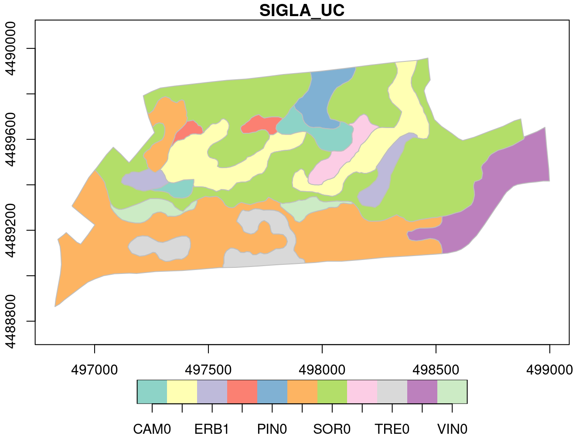
<p class="caption">(\#fig:fig-sf-valteldsm)Digital Soil Map of Telese Valley.</p>
</div>

#### Existing Vector Data Model | remote data source
The `getbb()` function can search in OpenStreetMap using a toponym (e.g. _Emilia Romagna_) and can return a simple feature as output (`format_out=sf_polygon`):

```r
require(osmdata)
ER  = osmdata::getbb("Emilia Romagna",format_out="sf_polygon")
names(ER)
#> [1] "polygon"      "multipolygon"
ER <- ER$multipolygon
```

In [section creating data from scratch](#scratch-realworld) we created the SF simple feature from scratch:

```r
SF # or print(SF)
#> Simple feature collection with 1 feature and 4 fields
#> Geometry type: POINT
#> Dimension:     XY
#> Bounding box:  xmin: 10.91571 ymin: 44.65191 xmax: 10.91571 ymax: 44.65191
#> Geodetic CRS:  WGS 84
#>        name       date temperature rainfall
#> 1 MODENAURB 2007-01-01         6.5        0
#>                    geometry
#> 1 POINT (10.91571 44.65191)
```


```r
plot(ER$geometry,reset=F)
plot(SF$geometry,add=T,pch=16,col="red")
axis(1, labels=TRUE)
axis(2, labels=TRUE)
text( st_coordinates(SF), 'MODENAURB', pos=2 )
title( xlab="Longitude [degree]", ylab="Latitude [degree]" )
```

<div class="figure" style="text-align: left">
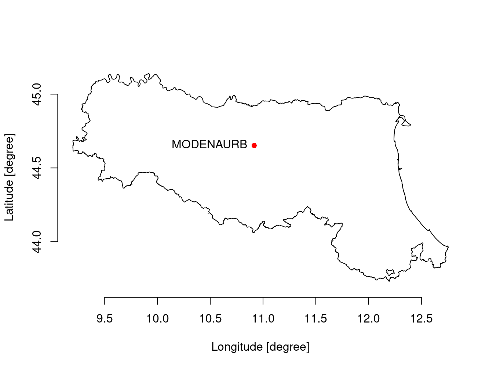
<p class="caption">(\#fig:fig-ER-station)Emilia Romagna Region with MODENAURB station.</p>
</div>

### Export a Simple Feature
In [section creating data from scratch](#scratch-realworld) we created the SF simple feature from scratch.

```r
SF # or print(SF)
#> Simple feature collection with 1 feature and 4 fields
#> Geometry type: POINT
#> Dimension:     XY
#> Bounding box:  xmin: 10.91571 ymin: 44.65191 xmax: 10.91571 ymax: 44.65191
#> Geodetic CRS:  WGS 84
#>        name       date temperature rainfall
#> 1 MODENAURB 2007-01-01         6.5        0
#>                    geometry
#> 1 POINT (10.91571 44.65191)
```

Let's export / save / write it to a file using a standard vector data model/driver (e.g. geojson format):


```r
st_write(SF,"my_first_simple_feature.geojson")
```
Note that the driver used to write data on HDD depends on the file extension provided: in the example above, it was used `.geojson` but any other extension can be used.

### Vector drivers / formats
Here follows the list of drivers that are available in the current GDAL installation:
<div style="border: 1px solid #ddd; padding: 0px; overflow-y: scroll; height:300px; overflow-x: scroll; width:100%; "><table class=" lightable-paper table" style='font-family: "Arial Narrow", arial, helvetica, sans-serif; margin-left: auto; margin-right: auto; margin-left: auto; margin-right: auto;'>
 <thead>
  <tr>
   <th style="text-align:left;position: sticky; top:0; background-color: #FFFFFF;position: sticky; top:0; background-color: #FFFFFF;"> name </th>
   <th style="text-align:left;position: sticky; top:0; background-color: #FFFFFF;position: sticky; top:0; background-color: #FFFFFF;"> long_name </th>
   <th style="text-align:left;position: sticky; top:0; background-color: #FFFFFF;position: sticky; top:0; background-color: #FFFFFF;"> write </th>
   <th style="text-align:left;position: sticky; top:0; background-color: #FFFFFF;position: sticky; top:0; background-color: #FFFFFF;"> copy </th>
   <th style="text-align:left;position: sticky; top:0; background-color: #FFFFFF;position: sticky; top:0; background-color: #FFFFFF;"> is_raster </th>
   <th style="text-align:left;position: sticky; top:0; background-color: #FFFFFF;position: sticky; top:0; background-color: #FFFFFF;"> is_vector </th>
   <th style="text-align:left;position: sticky; top:0; background-color: #FFFFFF;position: sticky; top:0; background-color: #FFFFFF;"> vsi </th>
  </tr>
 </thead>
<tbody>
  <tr>
   <td style="text-align:left;"> <span style=" font-weight: bold;    color: white !important;border-radius: 4px; padding-right: 4px; padding-left: 4px; background-color: orange !important;">ESRIC</span> </td>
   <td style="text-align:left;"> Esri Compact Cache </td>
   <td style="text-align:left;"> FALSE </td>
   <td style="text-align:left;"> FALSE </td>
   <td style="text-align:left;"> TRUE </td>
   <td style="text-align:left;"> TRUE </td>
   <td style="text-align:left;"> TRUE </td>
  </tr>
  <tr>
   <td style="text-align:left;"> <span style=" font-weight: bold;    color: white !important;border-radius: 4px; padding-right: 4px; padding-left: 4px; background-color: orange !important;">FITS</span> </td>
   <td style="text-align:left;"> Flexible Image Transport System </td>
   <td style="text-align:left;"> TRUE </td>
   <td style="text-align:left;"> FALSE </td>
   <td style="text-align:left;"> TRUE </td>
   <td style="text-align:left;"> TRUE </td>
   <td style="text-align:left;"> FALSE </td>
  </tr>
  <tr>
   <td style="text-align:left;"> <span style=" font-weight: bold;    color: white !important;border-radius: 4px; padding-right: 4px; padding-left: 4px; background-color: orange !important;">PCIDSK</span> </td>
   <td style="text-align:left;"> PCIDSK Database File </td>
   <td style="text-align:left;"> TRUE </td>
   <td style="text-align:left;"> FALSE </td>
   <td style="text-align:left;"> TRUE </td>
   <td style="text-align:left;"> TRUE </td>
   <td style="text-align:left;"> TRUE </td>
  </tr>
  <tr>
   <td style="text-align:left;"> <span style=" font-weight: bold;    color: white !important;border-radius: 4px; padding-right: 4px; padding-left: 4px; background-color: orange !important;">netCDF</span> </td>
   <td style="text-align:left;"> Network Common Data Format </td>
   <td style="text-align:left;"> TRUE </td>
   <td style="text-align:left;"> TRUE </td>
   <td style="text-align:left;"> TRUE </td>
   <td style="text-align:left;"> TRUE </td>
   <td style="text-align:left;"> TRUE </td>
  </tr>
  <tr>
   <td style="text-align:left;"> <span style=" font-weight: bold;    color: white !important;border-radius: 4px; padding-right: 4px; padding-left: 4px; background-color: orange !important;">PDS4</span> </td>
   <td style="text-align:left;"> NASA Planetary Data System 4 </td>
   <td style="text-align:left;"> TRUE </td>
   <td style="text-align:left;"> TRUE </td>
   <td style="text-align:left;"> TRUE </td>
   <td style="text-align:left;"> TRUE </td>
   <td style="text-align:left;"> TRUE </td>
  </tr>
  <tr>
   <td style="text-align:left;"> <span style=" font-weight: bold;    color: white !important;border-radius: 4px; padding-right: 4px; padding-left: 4px; background-color: orange !important;">VICAR</span> </td>
   <td style="text-align:left;"> MIPL VICAR file </td>
   <td style="text-align:left;"> TRUE </td>
   <td style="text-align:left;"> TRUE </td>
   <td style="text-align:left;"> TRUE </td>
   <td style="text-align:left;"> TRUE </td>
   <td style="text-align:left;"> TRUE </td>
  </tr>
  <tr>
   <td style="text-align:left;"> <span style=" font-weight: bold;    color: white !important;border-radius: 4px; padding-right: 4px; padding-left: 4px; background-color: orange !important;">JP2OpenJPEG</span> </td>
   <td style="text-align:left;"> JPEG-2000 driver based on OpenJPEG library </td>
   <td style="text-align:left;"> FALSE </td>
   <td style="text-align:left;"> TRUE </td>
   <td style="text-align:left;"> TRUE </td>
   <td style="text-align:left;"> TRUE </td>
   <td style="text-align:left;"> TRUE </td>
  </tr>
  <tr>
   <td style="text-align:left;"> <span style=" font-weight: bold;    color: white !important;border-radius: 4px; padding-right: 4px; padding-left: 4px; background-color: orange !important;">PDF</span> </td>
   <td style="text-align:left;"> Geospatial PDF </td>
   <td style="text-align:left;"> TRUE </td>
   <td style="text-align:left;"> TRUE </td>
   <td style="text-align:left;"> TRUE </td>
   <td style="text-align:left;"> TRUE </td>
   <td style="text-align:left;"> TRUE </td>
  </tr>
  <tr>
   <td style="text-align:left;"> <span style=" font-weight: bold;    color: white !important;border-radius: 4px; padding-right: 4px; padding-left: 4px; background-color: orange !important;">MBTiles</span> </td>
   <td style="text-align:left;"> MBTiles </td>
   <td style="text-align:left;"> TRUE </td>
   <td style="text-align:left;"> TRUE </td>
   <td style="text-align:left;"> TRUE </td>
   <td style="text-align:left;"> TRUE </td>
   <td style="text-align:left;"> TRUE </td>
  </tr>
  <tr>
   <td style="text-align:left;"> <span style=" font-weight: bold;    color: white !important;border-radius: 4px; padding-right: 4px; padding-left: 4px; background-color: orange !important;">BAG</span> </td>
   <td style="text-align:left;"> Bathymetry Attributed Grid </td>
   <td style="text-align:left;"> TRUE </td>
   <td style="text-align:left;"> TRUE </td>
   <td style="text-align:left;"> TRUE </td>
   <td style="text-align:left;"> TRUE </td>
   <td style="text-align:left;"> TRUE </td>
  </tr>
  <tr>
   <td style="text-align:left;"> <span style=" font-weight: bold;    color: white !important;border-radius: 4px; padding-right: 4px; padding-left: 4px; background-color: orange !important;">EEDA</span> </td>
   <td style="text-align:left;"> Earth Engine Data API </td>
   <td style="text-align:left;"> FALSE </td>
   <td style="text-align:left;"> FALSE </td>
   <td style="text-align:left;"> FALSE </td>
   <td style="text-align:left;"> TRUE </td>
   <td style="text-align:left;"> FALSE </td>
  </tr>
  <tr>
   <td style="text-align:left;"> <span style=" font-weight: bold;    color: white !important;border-radius: 4px; padding-right: 4px; padding-left: 4px; background-color: orange !important;">OGCAPI</span> </td>
   <td style="text-align:left;"> OGCAPI </td>
   <td style="text-align:left;"> FALSE </td>
   <td style="text-align:left;"> FALSE </td>
   <td style="text-align:left;"> TRUE </td>
   <td style="text-align:left;"> TRUE </td>
   <td style="text-align:left;"> TRUE </td>
  </tr>
  <tr>
   <td style="text-align:left;"> <span style=" font-weight: bold;    color: white !important;border-radius: 4px; padding-right: 4px; padding-left: 4px; background-color: orange !important;">ESRI Shapefile</span> </td>
   <td style="text-align:left;"> ESRI Shapefile </td>
   <td style="text-align:left;"> TRUE </td>
   <td style="text-align:left;"> FALSE </td>
   <td style="text-align:left;"> FALSE </td>
   <td style="text-align:left;"> TRUE </td>
   <td style="text-align:left;"> TRUE </td>
  </tr>
  <tr>
   <td style="text-align:left;"> <span style=" font-weight: bold;    color: white !important;border-radius: 4px; padding-right: 4px; padding-left: 4px; background-color: orange !important;">MapInfo File</span> </td>
   <td style="text-align:left;"> MapInfo File </td>
   <td style="text-align:left;"> TRUE </td>
   <td style="text-align:left;"> FALSE </td>
   <td style="text-align:left;"> FALSE </td>
   <td style="text-align:left;"> TRUE </td>
   <td style="text-align:left;"> TRUE </td>
  </tr>
  <tr>
   <td style="text-align:left;"> <span style=" font-weight: bold;    color: white !important;border-radius: 4px; padding-right: 4px; padding-left: 4px; background-color: orange !important;">UK .NTF</span> </td>
   <td style="text-align:left;"> UK .NTF </td>
   <td style="text-align:left;"> FALSE </td>
   <td style="text-align:left;"> FALSE </td>
   <td style="text-align:left;"> FALSE </td>
   <td style="text-align:left;"> TRUE </td>
   <td style="text-align:left;"> TRUE </td>
  </tr>
  <tr>
   <td style="text-align:left;"> <span style=" font-weight: bold;    color: white !important;border-radius: 4px; padding-right: 4px; padding-left: 4px; background-color: orange !important;">LVBAG</span> </td>
   <td style="text-align:left;"> Kadaster LV BAG Extract 2.0 </td>
   <td style="text-align:left;"> FALSE </td>
   <td style="text-align:left;"> FALSE </td>
   <td style="text-align:left;"> FALSE </td>
   <td style="text-align:left;"> TRUE </td>
   <td style="text-align:left;"> TRUE </td>
  </tr>
  <tr>
   <td style="text-align:left;"> <span style=" font-weight: bold;    color: white !important;border-radius: 4px; padding-right: 4px; padding-left: 4px; background-color: orange !important;">OGR_SDTS</span> </td>
   <td style="text-align:left;"> SDTS </td>
   <td style="text-align:left;"> FALSE </td>
   <td style="text-align:left;"> FALSE </td>
   <td style="text-align:left;"> FALSE </td>
   <td style="text-align:left;"> TRUE </td>
   <td style="text-align:left;"> TRUE </td>
  </tr>
  <tr>
   <td style="text-align:left;"> <span style=" font-weight: bold;    color: white !important;border-radius: 4px; padding-right: 4px; padding-left: 4px; background-color: orange !important;">S57</span> </td>
   <td style="text-align:left;"> IHO S-57 (ENC) </td>
   <td style="text-align:left;"> TRUE </td>
   <td style="text-align:left;"> FALSE </td>
   <td style="text-align:left;"> FALSE </td>
   <td style="text-align:left;"> TRUE </td>
   <td style="text-align:left;"> TRUE </td>
  </tr>
  <tr>
   <td style="text-align:left;"> <span style=" font-weight: bold;    color: white !important;border-radius: 4px; padding-right: 4px; padding-left: 4px; background-color: orange !important;">DGN</span> </td>
   <td style="text-align:left;"> Microstation DGN </td>
   <td style="text-align:left;"> TRUE </td>
   <td style="text-align:left;"> FALSE </td>
   <td style="text-align:left;"> FALSE </td>
   <td style="text-align:left;"> TRUE </td>
   <td style="text-align:left;"> TRUE </td>
  </tr>
  <tr>
   <td style="text-align:left;"> <span style=" font-weight: bold;    color: white !important;border-radius: 4px; padding-right: 4px; padding-left: 4px; background-color: orange !important;">OGR_VRT</span> </td>
   <td style="text-align:left;"> VRT - Virtual Datasource </td>
   <td style="text-align:left;"> FALSE </td>
   <td style="text-align:left;"> FALSE </td>
   <td style="text-align:left;"> FALSE </td>
   <td style="text-align:left;"> TRUE </td>
   <td style="text-align:left;"> TRUE </td>
  </tr>
  <tr>
   <td style="text-align:left;"> <span style=" font-weight: bold;    color: white !important;border-radius: 4px; padding-right: 4px; padding-left: 4px; background-color: orange !important;">REC</span> </td>
   <td style="text-align:left;"> EPIInfo .REC </td>
   <td style="text-align:left;"> FALSE </td>
   <td style="text-align:left;"> FALSE </td>
   <td style="text-align:left;"> FALSE </td>
   <td style="text-align:left;"> TRUE </td>
   <td style="text-align:left;"> FALSE </td>
  </tr>
  <tr>
   <td style="text-align:left;"> <span style=" font-weight: bold;    color: white !important;border-radius: 4px; padding-right: 4px; padding-left: 4px; background-color: orange !important;">Memory</span> </td>
   <td style="text-align:left;"> Memory </td>
   <td style="text-align:left;"> TRUE </td>
   <td style="text-align:left;"> FALSE </td>
   <td style="text-align:left;"> FALSE </td>
   <td style="text-align:left;"> TRUE </td>
   <td style="text-align:left;"> FALSE </td>
  </tr>
  <tr>
   <td style="text-align:left;"> <span style=" font-weight: bold;    color: white !important;border-radius: 4px; padding-right: 4px; padding-left: 4px; background-color: orange !important;">CSV</span> </td>
   <td style="text-align:left;"> Comma Separated Value (.csv) </td>
   <td style="text-align:left;"> TRUE </td>
   <td style="text-align:left;"> FALSE </td>
   <td style="text-align:left;"> FALSE </td>
   <td style="text-align:left;"> TRUE </td>
   <td style="text-align:left;"> TRUE </td>
  </tr>
  <tr>
   <td style="text-align:left;"> <span style=" font-weight: bold;    color: white !important;border-radius: 4px; padding-right: 4px; padding-left: 4px; background-color: orange !important;">NAS</span> </td>
   <td style="text-align:left;"> NAS - ALKIS </td>
   <td style="text-align:left;"> FALSE </td>
   <td style="text-align:left;"> FALSE </td>
   <td style="text-align:left;"> FALSE </td>
   <td style="text-align:left;"> TRUE </td>
   <td style="text-align:left;"> TRUE </td>
  </tr>
  <tr>
   <td style="text-align:left;"> <span style=" font-weight: bold;    color: white !important;border-radius: 4px; padding-right: 4px; padding-left: 4px; background-color: orange !important;">GML</span> </td>
   <td style="text-align:left;"> Geography Markup Language (GML) </td>
   <td style="text-align:left;"> TRUE </td>
   <td style="text-align:left;"> FALSE </td>
   <td style="text-align:left;"> FALSE </td>
   <td style="text-align:left;"> TRUE </td>
   <td style="text-align:left;"> TRUE </td>
  </tr>
  <tr>
   <td style="text-align:left;"> <span style=" font-weight: bold;    color: white !important;border-radius: 4px; padding-right: 4px; padding-left: 4px; background-color: orange !important;">GPX</span> </td>
   <td style="text-align:left;"> GPX </td>
   <td style="text-align:left;"> TRUE </td>
   <td style="text-align:left;"> FALSE </td>
   <td style="text-align:left;"> FALSE </td>
   <td style="text-align:left;"> TRUE </td>
   <td style="text-align:left;"> TRUE </td>
  </tr>
  <tr>
   <td style="text-align:left;"> <span style=" font-weight: bold;    color: white !important;border-radius: 4px; padding-right: 4px; padding-left: 4px; background-color: orange !important;">LIBKML</span> </td>
   <td style="text-align:left;"> Keyhole Markup Language (LIBKML) </td>
   <td style="text-align:left;"> TRUE </td>
   <td style="text-align:left;"> FALSE </td>
   <td style="text-align:left;"> FALSE </td>
   <td style="text-align:left;"> TRUE </td>
   <td style="text-align:left;"> TRUE </td>
  </tr>
  <tr>
   <td style="text-align:left;"> <span style=" font-weight: bold;    color: white !important;border-radius: 4px; padding-right: 4px; padding-left: 4px; background-color: orange !important;">KML</span> </td>
   <td style="text-align:left;"> Keyhole Markup Language (KML) </td>
   <td style="text-align:left;"> TRUE </td>
   <td style="text-align:left;"> FALSE </td>
   <td style="text-align:left;"> FALSE </td>
   <td style="text-align:left;"> TRUE </td>
   <td style="text-align:left;"> TRUE </td>
  </tr>
  <tr>
   <td style="text-align:left;"> <span style=" font-weight: bold;    color: white !important;border-radius: 4px; padding-right: 4px; padding-left: 4px; background-color: orange !important;">GeoJSON</span> </td>
   <td style="text-align:left;"> GeoJSON </td>
   <td style="text-align:left;"> TRUE </td>
   <td style="text-align:left;"> FALSE </td>
   <td style="text-align:left;"> FALSE </td>
   <td style="text-align:left;"> TRUE </td>
   <td style="text-align:left;"> TRUE </td>
  </tr>
  <tr>
   <td style="text-align:left;"> <span style=" font-weight: bold;    color: white !important;border-radius: 4px; padding-right: 4px; padding-left: 4px; background-color: orange !important;">GeoJSONSeq</span> </td>
   <td style="text-align:left;"> GeoJSON Sequence </td>
   <td style="text-align:left;"> TRUE </td>
   <td style="text-align:left;"> FALSE </td>
   <td style="text-align:left;"> FALSE </td>
   <td style="text-align:left;"> TRUE </td>
   <td style="text-align:left;"> TRUE </td>
  </tr>
  <tr>
   <td style="text-align:left;"> <span style=" font-weight: bold;    color: white !important;border-radius: 4px; padding-right: 4px; padding-left: 4px; background-color: orange !important;">ESRIJSON</span> </td>
   <td style="text-align:left;"> ESRIJSON </td>
   <td style="text-align:left;"> FALSE </td>
   <td style="text-align:left;"> FALSE </td>
   <td style="text-align:left;"> FALSE </td>
   <td style="text-align:left;"> TRUE </td>
   <td style="text-align:left;"> TRUE </td>
  </tr>
  <tr>
   <td style="text-align:left;"> <span style=" font-weight: bold;    color: white !important;border-radius: 4px; padding-right: 4px; padding-left: 4px; background-color: orange !important;">TopoJSON</span> </td>
   <td style="text-align:left;"> TopoJSON </td>
   <td style="text-align:left;"> FALSE </td>
   <td style="text-align:left;"> FALSE </td>
   <td style="text-align:left;"> FALSE </td>
   <td style="text-align:left;"> TRUE </td>
   <td style="text-align:left;"> TRUE </td>
  </tr>
  <tr>
   <td style="text-align:left;"> <span style=" font-weight: bold;    color: white !important;border-radius: 4px; padding-right: 4px; padding-left: 4px; background-color: orange !important;">Interlis 1</span> </td>
   <td style="text-align:left;"> Interlis 1 </td>
   <td style="text-align:left;"> TRUE </td>
   <td style="text-align:left;"> FALSE </td>
   <td style="text-align:left;"> FALSE </td>
   <td style="text-align:left;"> TRUE </td>
   <td style="text-align:left;"> TRUE </td>
  </tr>
  <tr>
   <td style="text-align:left;"> <span style=" font-weight: bold;    color: white !important;border-radius: 4px; padding-right: 4px; padding-left: 4px; background-color: orange !important;">Interlis 2</span> </td>
   <td style="text-align:left;"> Interlis 2 </td>
   <td style="text-align:left;"> TRUE </td>
   <td style="text-align:left;"> FALSE </td>
   <td style="text-align:left;"> FALSE </td>
   <td style="text-align:left;"> TRUE </td>
   <td style="text-align:left;"> TRUE </td>
  </tr>
  <tr>
   <td style="text-align:left;"> <span style=" font-weight: bold;    color: white !important;border-radius: 4px; padding-right: 4px; padding-left: 4px; background-color: orange !important;">OGR_GMT</span> </td>
   <td style="text-align:left;"> GMT ASCII Vectors (.gmt) </td>
   <td style="text-align:left;"> TRUE </td>
   <td style="text-align:left;"> FALSE </td>
   <td style="text-align:left;"> FALSE </td>
   <td style="text-align:left;"> TRUE </td>
   <td style="text-align:left;"> TRUE </td>
  </tr>
  <tr>
   <td style="text-align:left;"> <span style=" font-weight: bold;    color: white !important;border-radius: 4px; padding-right: 4px; padding-left: 4px; background-color: orange !important;">GPKG</span> </td>
   <td style="text-align:left;"> GeoPackage </td>
   <td style="text-align:left;"> TRUE </td>
   <td style="text-align:left;"> TRUE </td>
   <td style="text-align:left;"> TRUE </td>
   <td style="text-align:left;"> TRUE </td>
   <td style="text-align:left;"> TRUE </td>
  </tr>
  <tr>
   <td style="text-align:left;"> <span style=" font-weight: bold;    color: white !important;border-radius: 4px; padding-right: 4px; padding-left: 4px; background-color: orange !important;">SQLite</span> </td>
   <td style="text-align:left;"> SQLite / Spatialite </td>
   <td style="text-align:left;"> TRUE </td>
   <td style="text-align:left;"> FALSE </td>
   <td style="text-align:left;"> FALSE </td>
   <td style="text-align:left;"> TRUE </td>
   <td style="text-align:left;"> TRUE </td>
  </tr>
  <tr>
   <td style="text-align:left;"> <span style=" font-weight: bold;    color: white !important;border-radius: 4px; padding-right: 4px; padding-left: 4px; background-color: orange !important;">ODBC</span> </td>
   <td style="text-align:left;">  </td>
   <td style="text-align:left;"> FALSE </td>
   <td style="text-align:left;"> FALSE </td>
   <td style="text-align:left;"> FALSE </td>
   <td style="text-align:left;"> TRUE </td>
   <td style="text-align:left;"> FALSE </td>
  </tr>
  <tr>
   <td style="text-align:left;"> <span style=" font-weight: bold;    color: white !important;border-radius: 4px; padding-right: 4px; padding-left: 4px; background-color: orange !important;">WAsP</span> </td>
   <td style="text-align:left;"> WAsP .map format </td>
   <td style="text-align:left;"> TRUE </td>
   <td style="text-align:left;"> FALSE </td>
   <td style="text-align:left;"> FALSE </td>
   <td style="text-align:left;"> TRUE </td>
   <td style="text-align:left;"> TRUE </td>
  </tr>
  <tr>
   <td style="text-align:left;"> <span style=" font-weight: bold;    color: white !important;border-radius: 4px; padding-right: 4px; padding-left: 4px; background-color: orange !important;">PGeo</span> </td>
   <td style="text-align:left;"> ESRI Personal GeoDatabase </td>
   <td style="text-align:left;"> FALSE </td>
   <td style="text-align:left;"> FALSE </td>
   <td style="text-align:left;"> FALSE </td>
   <td style="text-align:left;"> TRUE </td>
   <td style="text-align:left;"> FALSE </td>
  </tr>
  <tr>
   <td style="text-align:left;"> <span style=" font-weight: bold;    color: white !important;border-radius: 4px; padding-right: 4px; padding-left: 4px; background-color: orange !important;">MSSQLSpatial</span> </td>
   <td style="text-align:left;"> Microsoft SQL Server Spatial Database </td>
   <td style="text-align:left;"> TRUE </td>
   <td style="text-align:left;"> FALSE </td>
   <td style="text-align:left;"> FALSE </td>
   <td style="text-align:left;"> TRUE </td>
   <td style="text-align:left;"> FALSE </td>
  </tr>
  <tr>
   <td style="text-align:left;"> <span style=" font-weight: bold;    color: white !important;border-radius: 4px; padding-right: 4px; padding-left: 4px; background-color: orange !important;">OGR_OGDI</span> </td>
   <td style="text-align:left;"> OGDI Vectors (VPF, VMAP, DCW) </td>
   <td style="text-align:left;"> FALSE </td>
   <td style="text-align:left;"> FALSE </td>
   <td style="text-align:left;"> FALSE </td>
   <td style="text-align:left;"> TRUE </td>
   <td style="text-align:left;"> FALSE </td>
  </tr>
  <tr>
   <td style="text-align:left;"> <span style=" font-weight: bold;    color: white !important;border-radius: 4px; padding-right: 4px; padding-left: 4px; background-color: orange !important;">PostgreSQL</span> </td>
   <td style="text-align:left;"> PostgreSQL/PostGIS </td>
   <td style="text-align:left;"> TRUE </td>
   <td style="text-align:left;"> FALSE </td>
   <td style="text-align:left;"> FALSE </td>
   <td style="text-align:left;"> TRUE </td>
   <td style="text-align:left;"> FALSE </td>
  </tr>
  <tr>
   <td style="text-align:left;"> <span style=" font-weight: bold;    color: white !important;border-radius: 4px; padding-right: 4px; padding-left: 4px; background-color: orange !important;">MySQL</span> </td>
   <td style="text-align:left;"> MySQL </td>
   <td style="text-align:left;"> TRUE </td>
   <td style="text-align:left;"> FALSE </td>
   <td style="text-align:left;"> FALSE </td>
   <td style="text-align:left;"> TRUE </td>
   <td style="text-align:left;"> FALSE </td>
  </tr>
  <tr>
   <td style="text-align:left;"> <span style=" font-weight: bold;    color: white !important;border-radius: 4px; padding-right: 4px; padding-left: 4px; background-color: orange !important;">OpenFileGDB</span> </td>
   <td style="text-align:left;"> ESRI FileGDB </td>
   <td style="text-align:left;"> FALSE </td>
   <td style="text-align:left;"> FALSE </td>
   <td style="text-align:left;"> FALSE </td>
   <td style="text-align:left;"> TRUE </td>
   <td style="text-align:left;"> TRUE </td>
  </tr>
  <tr>
   <td style="text-align:left;"> <span style=" font-weight: bold;    color: white !important;border-radius: 4px; padding-right: 4px; padding-left: 4px; background-color: orange !important;">DXF</span> </td>
   <td style="text-align:left;"> AutoCAD DXF </td>
   <td style="text-align:left;"> TRUE </td>
   <td style="text-align:left;"> FALSE </td>
   <td style="text-align:left;"> FALSE </td>
   <td style="text-align:left;"> TRUE </td>
   <td style="text-align:left;"> TRUE </td>
  </tr>
  <tr>
   <td style="text-align:left;"> <span style=" font-weight: bold;    color: white !important;border-radius: 4px; padding-right: 4px; padding-left: 4px; background-color: orange !important;">CAD</span> </td>
   <td style="text-align:left;"> AutoCAD Driver </td>
   <td style="text-align:left;"> FALSE </td>
   <td style="text-align:left;"> FALSE </td>
   <td style="text-align:left;"> TRUE </td>
   <td style="text-align:left;"> TRUE </td>
   <td style="text-align:left;"> TRUE </td>
  </tr>
  <tr>
   <td style="text-align:left;"> <span style=" font-weight: bold;    color: white !important;border-radius: 4px; padding-right: 4px; padding-left: 4px; background-color: orange !important;">FlatGeobuf</span> </td>
   <td style="text-align:left;"> FlatGeobuf </td>
   <td style="text-align:left;"> TRUE </td>
   <td style="text-align:left;"> FALSE </td>
   <td style="text-align:left;"> FALSE </td>
   <td style="text-align:left;"> TRUE </td>
   <td style="text-align:left;"> TRUE </td>
  </tr>
  <tr>
   <td style="text-align:left;"> <span style=" font-weight: bold;    color: white !important;border-radius: 4px; padding-right: 4px; padding-left: 4px; background-color: orange !important;">Geoconcept</span> </td>
   <td style="text-align:left;"> Geoconcept </td>
   <td style="text-align:left;"> TRUE </td>
   <td style="text-align:left;"> FALSE </td>
   <td style="text-align:left;"> FALSE </td>
   <td style="text-align:left;"> TRUE </td>
   <td style="text-align:left;"> TRUE </td>
  </tr>
  <tr>
   <td style="text-align:left;"> <span style=" font-weight: bold;    color: white !important;border-radius: 4px; padding-right: 4px; padding-left: 4px; background-color: orange !important;">GeoRSS</span> </td>
   <td style="text-align:left;"> GeoRSS </td>
   <td style="text-align:left;"> TRUE </td>
   <td style="text-align:left;"> FALSE </td>
   <td style="text-align:left;"> FALSE </td>
   <td style="text-align:left;"> TRUE </td>
   <td style="text-align:left;"> TRUE </td>
  </tr>
  <tr>
   <td style="text-align:left;"> <span style=" font-weight: bold;    color: white !important;border-radius: 4px; padding-right: 4px; padding-left: 4px; background-color: orange !important;">GPSTrackMaker</span> </td>
   <td style="text-align:left;"> GPSTrackMaker </td>
   <td style="text-align:left;"> TRUE </td>
   <td style="text-align:left;"> FALSE </td>
   <td style="text-align:left;"> FALSE </td>
   <td style="text-align:left;"> TRUE </td>
   <td style="text-align:left;"> TRUE </td>
  </tr>
  <tr>
   <td style="text-align:left;"> <span style=" font-weight: bold;    color: white !important;border-radius: 4px; padding-right: 4px; padding-left: 4px; background-color: orange !important;">VFK</span> </td>
   <td style="text-align:left;"> Czech Cadastral Exchange Data Format </td>
   <td style="text-align:left;"> FALSE </td>
   <td style="text-align:left;"> FALSE </td>
   <td style="text-align:left;"> FALSE </td>
   <td style="text-align:left;"> TRUE </td>
   <td style="text-align:left;"> FALSE </td>
  </tr>
  <tr>
   <td style="text-align:left;"> <span style=" font-weight: bold;    color: white !important;border-radius: 4px; padding-right: 4px; padding-left: 4px; background-color: orange !important;">PGDUMP</span> </td>
   <td style="text-align:left;"> PostgreSQL SQL dump </td>
   <td style="text-align:left;"> TRUE </td>
   <td style="text-align:left;"> FALSE </td>
   <td style="text-align:left;"> FALSE </td>
   <td style="text-align:left;"> TRUE </td>
   <td style="text-align:left;"> TRUE </td>
  </tr>
  <tr>
   <td style="text-align:left;"> <span style=" font-weight: bold;    color: white !important;border-radius: 4px; padding-right: 4px; padding-left: 4px; background-color: orange !important;">OSM</span> </td>
   <td style="text-align:left;"> OpenStreetMap XML and PBF </td>
   <td style="text-align:left;"> FALSE </td>
   <td style="text-align:left;"> FALSE </td>
   <td style="text-align:left;"> FALSE </td>
   <td style="text-align:left;"> TRUE </td>
   <td style="text-align:left;"> TRUE </td>
  </tr>
  <tr>
   <td style="text-align:left;"> <span style=" font-weight: bold;    color: white !important;border-radius: 4px; padding-right: 4px; padding-left: 4px; background-color: orange !important;">GPSBabel</span> </td>
   <td style="text-align:left;"> GPSBabel </td>
   <td style="text-align:left;"> TRUE </td>
   <td style="text-align:left;"> FALSE </td>
   <td style="text-align:left;"> FALSE </td>
   <td style="text-align:left;"> TRUE </td>
   <td style="text-align:left;"> FALSE </td>
  </tr>
  <tr>
   <td style="text-align:left;"> <span style=" font-weight: bold;    color: white !important;border-radius: 4px; padding-right: 4px; padding-left: 4px; background-color: orange !important;">OGR_PDS</span> </td>
   <td style="text-align:left;"> Planetary Data Systems TABLE </td>
   <td style="text-align:left;"> FALSE </td>
   <td style="text-align:left;"> FALSE </td>
   <td style="text-align:left;"> FALSE </td>
   <td style="text-align:left;"> TRUE </td>
   <td style="text-align:left;"> TRUE </td>
  </tr>
  <tr>
   <td style="text-align:left;"> <span style=" font-weight: bold;    color: white !important;border-radius: 4px; padding-right: 4px; padding-left: 4px; background-color: orange !important;">WFS</span> </td>
   <td style="text-align:left;"> OGC WFS (Web Feature Service) </td>
   <td style="text-align:left;"> FALSE </td>
   <td style="text-align:left;"> FALSE </td>
   <td style="text-align:left;"> FALSE </td>
   <td style="text-align:left;"> TRUE </td>
   <td style="text-align:left;"> TRUE </td>
  </tr>
  <tr>
   <td style="text-align:left;"> <span style=" font-weight: bold;    color: white !important;border-radius: 4px; padding-right: 4px; padding-left: 4px; background-color: orange !important;">OAPIF</span> </td>
   <td style="text-align:left;"> OGC API - Features </td>
   <td style="text-align:left;"> FALSE </td>
   <td style="text-align:left;"> FALSE </td>
   <td style="text-align:left;"> FALSE </td>
   <td style="text-align:left;"> TRUE </td>
   <td style="text-align:left;"> FALSE </td>
  </tr>
  <tr>
   <td style="text-align:left;"> <span style=" font-weight: bold;    color: white !important;border-radius: 4px; padding-right: 4px; padding-left: 4px; background-color: orange !important;">SOSI</span> </td>
   <td style="text-align:left;"> Norwegian SOSI Standard </td>
   <td style="text-align:left;"> FALSE </td>
   <td style="text-align:left;"> FALSE </td>
   <td style="text-align:left;"> FALSE </td>
   <td style="text-align:left;"> TRUE </td>
   <td style="text-align:left;"> FALSE </td>
  </tr>
  <tr>
   <td style="text-align:left;"> <span style=" font-weight: bold;    color: white !important;border-radius: 4px; padding-right: 4px; padding-left: 4px; background-color: orange !important;">Geomedia</span> </td>
   <td style="text-align:left;"> Geomedia .mdb </td>
   <td style="text-align:left;"> FALSE </td>
   <td style="text-align:left;"> FALSE </td>
   <td style="text-align:left;"> FALSE </td>
   <td style="text-align:left;"> TRUE </td>
   <td style="text-align:left;"> FALSE </td>
  </tr>
  <tr>
   <td style="text-align:left;"> <span style=" font-weight: bold;    color: white !important;border-radius: 4px; padding-right: 4px; padding-left: 4px; background-color: orange !important;">EDIGEO</span> </td>
   <td style="text-align:left;"> French EDIGEO exchange format </td>
   <td style="text-align:left;"> FALSE </td>
   <td style="text-align:left;"> FALSE </td>
   <td style="text-align:left;"> FALSE </td>
   <td style="text-align:left;"> TRUE </td>
   <td style="text-align:left;"> TRUE </td>
  </tr>
  <tr>
   <td style="text-align:left;"> <span style=" font-weight: bold;    color: white !important;border-radius: 4px; padding-right: 4px; padding-left: 4px; background-color: orange !important;">SVG</span> </td>
   <td style="text-align:left;"> Scalable Vector Graphics </td>
   <td style="text-align:left;"> FALSE </td>
   <td style="text-align:left;"> FALSE </td>
   <td style="text-align:left;"> FALSE </td>
   <td style="text-align:left;"> TRUE </td>
   <td style="text-align:left;"> TRUE </td>
  </tr>
  <tr>
   <td style="text-align:left;"> <span style=" font-weight: bold;    color: white !important;border-radius: 4px; padding-right: 4px; padding-left: 4px; background-color: orange !important;">CouchDB</span> </td>
   <td style="text-align:left;"> CouchDB / GeoCouch </td>
   <td style="text-align:left;"> TRUE </td>
   <td style="text-align:left;"> FALSE </td>
   <td style="text-align:left;"> FALSE </td>
   <td style="text-align:left;"> TRUE </td>
   <td style="text-align:left;"> FALSE </td>
  </tr>
  <tr>
   <td style="text-align:left;"> <span style=" font-weight: bold;    color: white !important;border-radius: 4px; padding-right: 4px; padding-left: 4px; background-color: orange !important;">Cloudant</span> </td>
   <td style="text-align:left;"> Cloudant / CouchDB </td>
   <td style="text-align:left;"> TRUE </td>
   <td style="text-align:left;"> FALSE </td>
   <td style="text-align:left;"> FALSE </td>
   <td style="text-align:left;"> TRUE </td>
   <td style="text-align:left;"> FALSE </td>
  </tr>
  <tr>
   <td style="text-align:left;"> <span style=" font-weight: bold;    color: white !important;border-radius: 4px; padding-right: 4px; padding-left: 4px; background-color: orange !important;">Idrisi</span> </td>
   <td style="text-align:left;"> Idrisi Vector (.vct) </td>
   <td style="text-align:left;"> FALSE </td>
   <td style="text-align:left;"> FALSE </td>
   <td style="text-align:left;"> FALSE </td>
   <td style="text-align:left;"> TRUE </td>
   <td style="text-align:left;"> TRUE </td>
  </tr>
  <tr>
   <td style="text-align:left;"> <span style=" font-weight: bold;    color: white !important;border-radius: 4px; padding-right: 4px; padding-left: 4px; background-color: orange !important;">ARCGEN</span> </td>
   <td style="text-align:left;"> Arc/Info Generate </td>
   <td style="text-align:left;"> FALSE </td>
   <td style="text-align:left;"> FALSE </td>
   <td style="text-align:left;"> FALSE </td>
   <td style="text-align:left;"> TRUE </td>
   <td style="text-align:left;"> TRUE </td>
  </tr>
  <tr>
   <td style="text-align:left;"> <span style=" font-weight: bold;    color: white !important;border-radius: 4px; padding-right: 4px; padding-left: 4px; background-color: orange !important;">XLS</span> </td>
   <td style="text-align:left;"> MS Excel format </td>
   <td style="text-align:left;"> FALSE </td>
   <td style="text-align:left;"> FALSE </td>
   <td style="text-align:left;"> FALSE </td>
   <td style="text-align:left;"> TRUE </td>
   <td style="text-align:left;"> FALSE </td>
  </tr>
  <tr>
   <td style="text-align:left;"> <span style=" font-weight: bold;    color: white !important;border-radius: 4px; padding-right: 4px; padding-left: 4px; background-color: orange !important;">ODS</span> </td>
   <td style="text-align:left;"> Open Document/ LibreOffice / OpenOffice Spreadsheet </td>
   <td style="text-align:left;"> TRUE </td>
   <td style="text-align:left;"> FALSE </td>
   <td style="text-align:left;"> FALSE </td>
   <td style="text-align:left;"> TRUE </td>
   <td style="text-align:left;"> TRUE </td>
  </tr>
  <tr>
   <td style="text-align:left;"> <span style=" font-weight: bold;    color: white !important;border-radius: 4px; padding-right: 4px; padding-left: 4px; background-color: orange !important;">XLSX</span> </td>
   <td style="text-align:left;"> MS Office Open XML spreadsheet </td>
   <td style="text-align:left;"> TRUE </td>
   <td style="text-align:left;"> FALSE </td>
   <td style="text-align:left;"> FALSE </td>
   <td style="text-align:left;"> TRUE </td>
   <td style="text-align:left;"> TRUE </td>
  </tr>
  <tr>
   <td style="text-align:left;"> <span style=" font-weight: bold;    color: white !important;border-radius: 4px; padding-right: 4px; padding-left: 4px; background-color: orange !important;">Elasticsearch</span> </td>
   <td style="text-align:left;"> Elastic Search </td>
   <td style="text-align:left;"> TRUE </td>
   <td style="text-align:left;"> FALSE </td>
   <td style="text-align:left;"> FALSE </td>
   <td style="text-align:left;"> TRUE </td>
   <td style="text-align:left;"> FALSE </td>
  </tr>
  <tr>
   <td style="text-align:left;"> <span style=" font-weight: bold;    color: white !important;border-radius: 4px; padding-right: 4px; padding-left: 4px; background-color: orange !important;">Walk</span> </td>
   <td style="text-align:left;">  </td>
   <td style="text-align:left;"> FALSE </td>
   <td style="text-align:left;"> FALSE </td>
   <td style="text-align:left;"> FALSE </td>
   <td style="text-align:left;"> TRUE </td>
   <td style="text-align:left;"> FALSE </td>
  </tr>
  <tr>
   <td style="text-align:left;"> <span style=" font-weight: bold;    color: white !important;border-radius: 4px; padding-right: 4px; padding-left: 4px; background-color: orange !important;">Carto</span> </td>
   <td style="text-align:left;"> Carto </td>
   <td style="text-align:left;"> TRUE </td>
   <td style="text-align:left;"> FALSE </td>
   <td style="text-align:left;"> FALSE </td>
   <td style="text-align:left;"> TRUE </td>
   <td style="text-align:left;"> FALSE </td>
  </tr>
  <tr>
   <td style="text-align:left;"> <span style=" font-weight: bold;    color: white !important;border-radius: 4px; padding-right: 4px; padding-left: 4px; background-color: orange !important;">AmigoCloud</span> </td>
   <td style="text-align:left;"> AmigoCloud </td>
   <td style="text-align:left;"> TRUE </td>
   <td style="text-align:left;"> FALSE </td>
   <td style="text-align:left;"> FALSE </td>
   <td style="text-align:left;"> TRUE </td>
   <td style="text-align:left;"> FALSE </td>
  </tr>
  <tr>
   <td style="text-align:left;"> <span style=" font-weight: bold;    color: white !important;border-radius: 4px; padding-right: 4px; padding-left: 4px; background-color: orange !important;">SXF</span> </td>
   <td style="text-align:left;"> Storage and eXchange Format </td>
   <td style="text-align:left;"> FALSE </td>
   <td style="text-align:left;"> FALSE </td>
   <td style="text-align:left;"> FALSE </td>
   <td style="text-align:left;"> TRUE </td>
   <td style="text-align:left;"> TRUE </td>
  </tr>
  <tr>
   <td style="text-align:left;"> <span style=" font-weight: bold;    color: white !important;border-radius: 4px; padding-right: 4px; padding-left: 4px; background-color: orange !important;">Selafin</span> </td>
   <td style="text-align:left;"> Selafin </td>
   <td style="text-align:left;"> TRUE </td>
   <td style="text-align:left;"> FALSE </td>
   <td style="text-align:left;"> FALSE </td>
   <td style="text-align:left;"> TRUE </td>
   <td style="text-align:left;"> TRUE </td>
  </tr>
  <tr>
   <td style="text-align:left;"> <span style=" font-weight: bold;    color: white !important;border-radius: 4px; padding-right: 4px; padding-left: 4px; background-color: orange !important;">JML</span> </td>
   <td style="text-align:left;"> OpenJUMP JML </td>
   <td style="text-align:left;"> TRUE </td>
   <td style="text-align:left;"> FALSE </td>
   <td style="text-align:left;"> FALSE </td>
   <td style="text-align:left;"> TRUE </td>
   <td style="text-align:left;"> TRUE </td>
  </tr>
  <tr>
   <td style="text-align:left;"> <span style=" font-weight: bold;    color: white !important;border-radius: 4px; padding-right: 4px; padding-left: 4px; background-color: orange !important;">PLSCENES</span> </td>
   <td style="text-align:left;"> Planet Labs Scenes API </td>
   <td style="text-align:left;"> FALSE </td>
   <td style="text-align:left;"> FALSE </td>
   <td style="text-align:left;"> TRUE </td>
   <td style="text-align:left;"> TRUE </td>
   <td style="text-align:left;"> FALSE </td>
  </tr>
  <tr>
   <td style="text-align:left;"> <span style=" font-weight: bold;    color: white !important;border-radius: 4px; padding-right: 4px; padding-left: 4px; background-color: orange !important;">CSW</span> </td>
   <td style="text-align:left;"> OGC CSW (Catalog  Service for the Web) </td>
   <td style="text-align:left;"> FALSE </td>
   <td style="text-align:left;"> FALSE </td>
   <td style="text-align:left;"> FALSE </td>
   <td style="text-align:left;"> TRUE </td>
   <td style="text-align:left;"> FALSE </td>
  </tr>
  <tr>
   <td style="text-align:left;"> <span style=" font-weight: bold;    color: white !important;border-radius: 4px; padding-right: 4px; padding-left: 4px; background-color: orange !important;">VDV</span> </td>
   <td style="text-align:left;"> VDV-451/VDV-452/INTREST Data Format </td>
   <td style="text-align:left;"> TRUE </td>
   <td style="text-align:left;"> FALSE </td>
   <td style="text-align:left;"> FALSE </td>
   <td style="text-align:left;"> TRUE </td>
   <td style="text-align:left;"> TRUE </td>
  </tr>
  <tr>
   <td style="text-align:left;"> <span style=" font-weight: bold;    color: white !important;border-radius: 4px; padding-right: 4px; padding-left: 4px; background-color: orange !important;">GMLAS</span> </td>
   <td style="text-align:left;"> Geography Markup Language (GML) driven by application schemas </td>
   <td style="text-align:left;"> FALSE </td>
   <td style="text-align:left;"> TRUE </td>
   <td style="text-align:left;"> FALSE </td>
   <td style="text-align:left;"> TRUE </td>
   <td style="text-align:left;"> TRUE </td>
  </tr>
  <tr>
   <td style="text-align:left;"> <span style=" font-weight: bold;    color: white !important;border-radius: 4px; padding-right: 4px; padding-left: 4px; background-color: orange !important;">MVT</span> </td>
   <td style="text-align:left;"> Mapbox Vector Tiles </td>
   <td style="text-align:left;"> TRUE </td>
   <td style="text-align:left;"> FALSE </td>
   <td style="text-align:left;"> FALSE </td>
   <td style="text-align:left;"> TRUE </td>
   <td style="text-align:left;"> TRUE </td>
  </tr>
  <tr>
   <td style="text-align:left;"> <span style=" font-weight: bold;    color: white !important;border-radius: 4px; padding-right: 4px; padding-left: 4px; background-color: orange !important;">NGW</span> </td>
   <td style="text-align:left;"> NextGIS Web </td>
   <td style="text-align:left;"> TRUE </td>
   <td style="text-align:left;"> TRUE </td>
   <td style="text-align:left;"> TRUE </td>
   <td style="text-align:left;"> TRUE </td>
   <td style="text-align:left;"> FALSE </td>
  </tr>
  <tr>
   <td style="text-align:left;"> <span style=" font-weight: bold;    color: white !important;border-radius: 4px; padding-right: 4px; padding-left: 4px; background-color: orange !important;">MapML</span> </td>
   <td style="text-align:left;"> MapML </td>
   <td style="text-align:left;"> TRUE </td>
   <td style="text-align:left;"> FALSE </td>
   <td style="text-align:left;"> FALSE </td>
   <td style="text-align:left;"> TRUE </td>
   <td style="text-align:left;"> TRUE </td>
  </tr>
  <tr>
   <td style="text-align:left;"> <span style=" font-weight: bold;    color: white !important;border-radius: 4px; padding-right: 4px; padding-left: 4px; background-color: orange !important;">TIGER</span> </td>
   <td style="text-align:left;"> U.S. Census TIGER/Line </td>
   <td style="text-align:left;"> TRUE </td>
   <td style="text-align:left;"> FALSE </td>
   <td style="text-align:left;"> FALSE </td>
   <td style="text-align:left;"> TRUE </td>
   <td style="text-align:left;"> TRUE </td>
  </tr>
  <tr>
   <td style="text-align:left;"> <span style=" font-weight: bold;    color: white !important;border-radius: 4px; padding-right: 4px; padding-left: 4px; background-color: orange !important;">AVCBin</span> </td>
   <td style="text-align:left;"> Arc/Info Binary Coverage </td>
   <td style="text-align:left;"> FALSE </td>
   <td style="text-align:left;"> FALSE </td>
   <td style="text-align:left;"> FALSE </td>
   <td style="text-align:left;"> TRUE </td>
   <td style="text-align:left;"> TRUE </td>
  </tr>
  <tr>
   <td style="text-align:left;"> <span style=" font-weight: bold;    color: white !important;border-radius: 4px; padding-right: 4px; padding-left: 4px; background-color: orange !important;">AVCE00</span> </td>
   <td style="text-align:left;"> Arc/Info E00 (ASCII) Coverage </td>
   <td style="text-align:left;"> FALSE </td>
   <td style="text-align:left;"> FALSE </td>
   <td style="text-align:left;"> FALSE </td>
   <td style="text-align:left;"> TRUE </td>
   <td style="text-align:left;"> TRUE </td>
  </tr>
  <tr>
   <td style="text-align:left;"> <span style=" font-weight: bold;    color: white !important;border-radius: 4px; padding-right: 4px; padding-left: 4px; background-color: orange !important;">HTTP</span> </td>
   <td style="text-align:left;"> HTTP Fetching Wrapper </td>
   <td style="text-align:left;"> FALSE </td>
   <td style="text-align:left;"> FALSE </td>
   <td style="text-align:left;"> TRUE </td>
   <td style="text-align:left;"> TRUE </td>
   <td style="text-align:left;"> FALSE </td>
  </tr>
</tbody>
</table></div>
#### Exercise
Annotate the drivers from the list that you already know.


